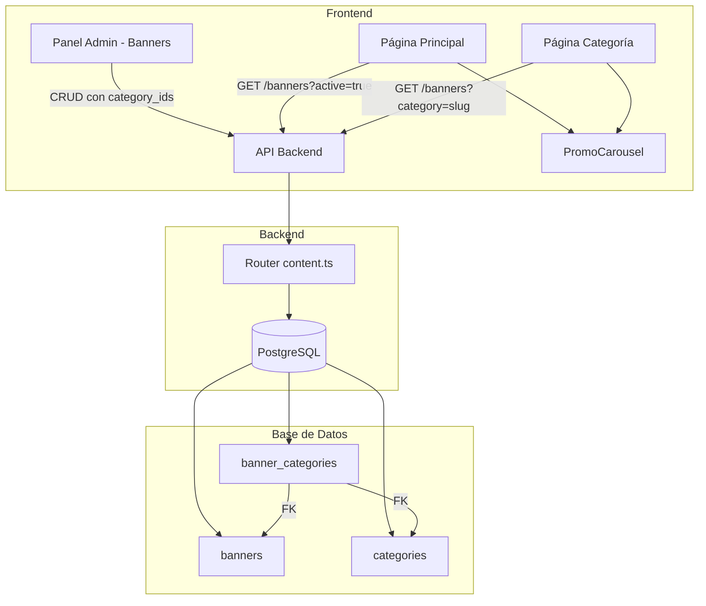

# Documento de Diseño: Banners por Categoría

## Visión General

Este diseño extiende el sistema de banners existente para soportar la asociación de banners a categorías de productos. Se introduce una tabla de relación muchos-a-muchos (`banner_categories`) entre `banners` y `categories`. El carrusel principal sigue mostrando todos los banners activos, mientras que las páginas de categoría muestran solo los banners asociados a esa categoría específica.

El enfoque prioriza cambios mínimos: se reutiliza el componente `PromoCarousel` existente, se extiende el endpoint actual de banners con un query parameter opcional, y se agrega un selector de categorías al formulario del admin.

## Arquitectura



El flujo es:
1. El admin crea/edita un banner y selecciona categorías en el formulario.
2. El backend almacena el banner y las relaciones en `banner_categories`.
3. La página principal consulta todos los banners activos (sin filtro de categoría).
4. La página de categoría consulta banners filtrados por slug de categoría.
5. Ambas páginas renderizan los banners usando el mismo componente `PromoCarousel`.

## Componentes e Interfaces

### 1. Migración SQL (`003_banner_categories.sql`)

Crea la tabla intermedia `banner_categories` con claves foráneas y eliminación en cascada.

### 2. Backend - Rutas (`backend/src/routes/content.ts`)

Se modifican los endpoints existentes:

- **GET `/banners`**: Se agrega soporte para query param `category`. Si se proporciona, se hace JOIN con `banner_categories` y `categories` para filtrar por slug.
- **POST `/banners`**: Se acepta un campo opcional `category_ids: string[]` en el body. Después de insertar el banner, se insertan las filas correspondientes en `banner_categories`.
- **PUT `/banners/:id`**: Se acepta `category_ids` opcional. Si se proporciona, se eliminan las relaciones existentes y se insertan las nuevas (replace strategy).
- **DELETE `/banners/:id`**: Sin cambios necesarios gracias al `ON DELETE CASCADE`.
- **GET `/banners/:id/categories`** (nuevo, opcional): Retorna las categorías asociadas a un banner específico.

### 3. Frontend - Tipos (`src/types/skating-store.ts`)

Se extiende la interfaz `Banner`:

```typescript
export interface Banner {
  id: string;
  title: string;
  description?: string;
  image_url: string;
  link_url?: string;
  active: boolean;
  display_order: number;
  created_at: string;
  category_ids?: string[];   // IDs de categorías asociadas
  categories?: Category[];   // Categorías populadas (para admin)
}
```

### 4. Frontend - Admin (`src/app/admin/banners/page.tsx`)

Se modifica el formulario de creación/edición:

- Se agrega un selector multi-categoría (checkboxes o multi-select) que muestra las categorías disponibles.
- Al guardar, se envía `category_ids` junto con los demás campos del banner.
- En la tabla de listado, se agrega una columna "Categorías" que muestra badges con los nombres de las categorías asociadas, o "General" si no tiene ninguna.

### 5. Frontend - Página de Catálogo (`src/app/skating-store/catalogo/page.tsx`)

Se modifica para:

- Cuando hay un filtro de categoría activo, consultar los banners de esa categoría.
- Si hay banners, renderizar `PromoCarousel` encima de la grilla de productos.
- Si no hay banners para esa categoría, no mostrar el carrusel.

### 6. Frontend - Queries (`src/lib/skating-store/content-queries.ts`)

Se agrega función:

```typescript
export async function getBannersByCategory(categorySlug: string): Promise<Banner[]> {
  return serverFetch<Banner[]>(`/api/content/banners?category=${categorySlug}&active=true`);
}
```

### 7. Frontend - Content Actions (`src/lib/skating-store/content-actions.ts`)

Se modifican `createBanner` y `updateBanner` para incluir `category_ids` en el payload.

## Modelos de Datos

### Tabla `banner_categories` (nueva)

| Columna     | Tipo | Restricciones                                      |
|-------------|------|-----------------------------------------------------|
| id          | UUID | PK, DEFAULT gen_random_uuid()                       |
| banner_id   | UUID | FK → banners(id) ON DELETE CASCADE, NOT NULL         |
| category_id | UUID | FK → categories(id) ON DELETE CASCADE, NOT NULL      |
| created_at  | TIMESTAMPTZ | DEFAULT NOW()                                 |

**Restricción UNIQUE**: `(banner_id, category_id)` para evitar duplicados.

**Índices**:
- `idx_banner_categories_banner` en `banner_id`
- `idx_banner_categories_category` en `category_id`

### Tabla `banners` (sin cambios)

La tabla `banners` no se modifica. La relación con categorías se maneja enteramente a través de `banner_categories`.

### Consulta SQL para banners por categoría

```sql
SELECT b.* FROM banners b
JOIN banner_categories bc ON bc.banner_id = b.id
JOIN categories c ON c.id = bc.category_id
WHERE c.slug = $1 AND b.active = TRUE
ORDER BY b.display_order ASC;
```

### Consulta SQL para banners con sus categorías (admin)

```sql
SELECT b.*, 
  COALESCE(json_agg(json_build_object('id', c.id, 'name', c.name, 'slug', c.slug)) 
  FILTER (WHERE c.id IS NOT NULL), '[]') as categories
FROM banners b
LEFT JOIN banner_categories bc ON bc.banner_id = b.id
LEFT JOIN categories c ON c.id = bc.category_id
GROUP BY b.id
ORDER BY b.display_order ASC;
```


## Propiedades de Correctitud

*Una propiedad es una característica o comportamiento que debe mantenerse verdadero en todas las ejecuciones válidas de un sistema — esencialmente, una declaración formal sobre lo que el sistema debe hacer. Las propiedades sirven como puente entre especificaciones legibles por humanos y garantías de correctitud verificables por máquina.*

### Propiedad 1: Round-trip de asociación banner-categoría

*Para cualquier* banner y cualquier subconjunto no vacío de categorías existentes, si se crea el banner asociado a esas categorías, entonces consultar los banners de cada una de esas categorías debe incluir ese banner en los resultados.

**Valida: Requisitos 1.4, 2.4, 5.1**

### Propiedad 2: Eliminación en cascada de banner

*Para cualquier* banner con cualquier número de categorías asociadas, al eliminar el banner, la tabla `banner_categories` no debe contener ninguna fila que referencie el `id` del banner eliminado.

**Valida: Requisitos 2.2**

### Propiedad 3: Eliminación en cascada de categoría

*Para cualquier* categoría con cualquier número de banners asociados, al eliminar la categoría, la tabla `banner_categories` no debe contener ninguna fila que referencie el `id` de la categoría eliminada.

**Valida: Requisitos 2.3**

### Propiedad 4: Carrusel principal muestra todos los banners activos ordenados

*Para cualquier* conjunto de banners (algunos activos, algunos inactivos, algunos con categorías, algunos sin), la consulta del carrusel principal (sin filtro de categoría) debe retornar exactamente todos los banners activos, y estos deben estar ordenados por `display_order` de forma ascendente.

**Valida: Requisitos 3.1, 3.2, 5.3**

## Manejo de Errores

| Escenario | Comportamiento |
|-----------|---------------|
| `category_ids` contiene un UUID que no existe en `categories` | El INSERT en `banner_categories` falla por FK constraint. El backend retorna error 400 con mensaje descriptivo. La transacción se revierte. |
| Slug de categoría inexistente en GET `/banners?category=xxx` | Se retorna un arreglo vacío `[]` con status 200. |
| Error de base de datos al insertar relaciones | Se revierte la transacción completa (banner + relaciones). Se retorna error 500. |
| Banner sin imagen al intentar guardar | Validación existente en el frontend y backend rechaza la creación. Sin cambios. |

## Estrategia de Testing

### Testing Dual

Se utilizan dos enfoques complementarios:

1. **Tests unitarios**: Verifican ejemplos específicos, casos borde y condiciones de error.
2. **Tests de propiedades (PBT)**: Verifican propiedades universales con entradas generadas aleatoriamente.

### Librería de Property-Based Testing

Se utilizará **fast-check** para TypeScript, que es compatible con el stack del proyecto (Node.js/TypeScript).

### Configuración de Tests de Propiedades

- Mínimo 100 iteraciones por test de propiedad.
- Cada test debe referenciar la propiedad del diseño con un comentario.
- Formato de tag: **Feature: category-banners, Property {N}: {título}**

### Tests Unitarios

- Crear banner sin categorías → verificar que no se crean filas en `banner_categories`.
- Crear banner con categorías → verificar que la columna "Categorías" en el admin muestra los nombres correctos.
- Consultar banners con slug inexistente → verificar respuesta vacía.
- Editar banner cambiando categorías → verificar que las relaciones anteriores se reemplazan.
- Verificar que el carrusel no se renderiza en la página de categoría cuando no hay banners asociados.

### Tests de Propiedades

- **Feature: category-banners, Property 1: Round-trip de asociación banner-categoría** — Generar banners con subconjuntos aleatorios de categorías, verificar que la consulta por categoría los retorna.
- **Feature: category-banners, Property 2: Eliminación en cascada de banner** — Generar banners con relaciones, eliminarlos, verificar limpieza.
- **Feature: category-banners, Property 3: Eliminación en cascada de categoría** — Generar categorías con banners asociados, eliminarlas, verificar limpieza.
- **Feature: category-banners, Property 4: Carrusel principal muestra todos los banners activos ordenados** — Generar conjuntos mixtos de banners, verificar que la consulta sin filtro retorna exactamente los activos, ordenados.
