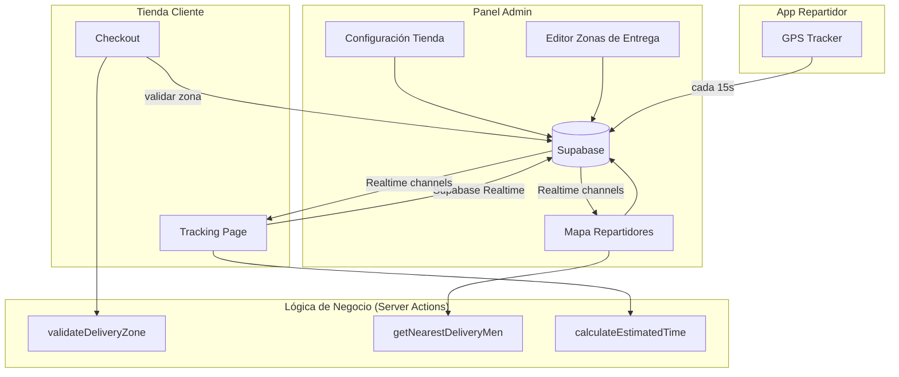

# Documento de Diseño: Zonas de Entrega y Rastreo en Tiempo Real

## Resumen

Este diseño extiende el sistema de entregas existente de la tienda de patinaje con tres capacidades principales:

1. **Zonas de entrega configurables**: Los administradores definen la ubicación de la tienda y dibujan polígonos en un mapa para delimitar las áreas de cobertura. Durante el checkout, se valida que la dirección del cliente esté dentro de una zona activa.
2. **Rastreo en tiempo real de repartidores**: Los repartidores envían su ubicación GPS periódicamente a una tabla dedicada (`delivery_locations`), independiente de si tienen envíos activos. El admin ve todas las posiciones en el mapa y el sistema sugiere al repartidor más cercano a la tienda al asignar pedidos.
3. **Tiempo estimado de entrega**: Se calcula un ETA basado en la distancia (Haversine) entre el repartidor/tienda y el destino del cliente, y se muestra en la página de tracking con actualizaciones en tiempo real.

El sistema reutiliza la infraestructura existente: Supabase (base de datos + Realtime), Leaflet/react-leaflet para mapas, y la arquitectura de server actions de Next.js.

## Arquitectura



## Componentes e Interfaces

### 1. Configuración de Tienda (`store_settings`)

Se usa la tabla existente `static_content` con slug `store-location` para almacenar la ubicación de la tienda. Esto evita crear una tabla nueva y reutiliza el patrón ya establecido en el proyecto.

**Componente Admin**: `StoreLocationConfig` — formulario con mapa para seleccionar la ubicación de la tienda haciendo clic en el mapa o ingresando coordenadas manualmente.

### 2. Zonas de Entrega (`delivery_zones`)

**Nueva tabla** en Supabase para almacenar polígonos de zonas de entrega.

**Componente Admin**: `DeliveryZoneEditor` — mapa interactivo con Leaflet donde el admin puede:
- Dibujar polígonos (usando `leaflet-draw` o clicks manuales para definir vértices)
- Editar polígonos existentes
- Activar/desactivar zonas
- Eliminar zonas

### 3. Validación de Zona en Checkout

**Server Action**: `validateDeliveryZone(lat, lng)` — usa el algoritmo de ray-casting (point-in-polygon) para verificar si un punto está dentro de alguna zona activa.

**Integración**: Se invoca en el `CheckoutForm` antes de permitir el submit. Se agrega un paso de geocodificación o selección en mapa para obtener coordenadas precisas del cliente.

### 4. Rastreo de Ubicación de Repartidores

**Nueva tabla**: `delivery_locations` — almacena la última ubicación conocida de cada repartidor, independiente de envíos activos.

**Componente Repartidor**: Se modifica el `DeliveryDashboard` existente para enviar ubicación GPS cada 15 segundos a `delivery_locations` (en lugar de solo actualizar `shipments`).

**Componente Admin**: Se extiende `DeliveryMap` para mostrar:
- Posiciones de repartidores desde `delivery_locations`
- Zonas de entrega como polígonos
- Ubicación de la tienda como marcador especial

### 5. Asignación por Cercanía

**Server Action**: `getNearestDeliveryMen(storeLat, storeLng)` — consulta `delivery_locations`, calcula distancia Haversine a la tienda, y retorna repartidores ordenados por distancia.

**Integración**: En la página de asignación de pedidos del admin, se muestra la distancia de cada repartidor a la tienda.

### 6. Estimación de Tiempo de Entrega

**Función utilitaria**: `calculateEstimatedTime(distanceKm)` — convierte distancia en un rango de tiempo estimado asumiendo una velocidad promedio de entrega urbana (~20-30 km/h).

**Integración**: Se muestra en la página de tracking (`/skating-store/tracking/[id]`) y se actualiza en tiempo real cuando la ubicación del repartidor cambia.

## Modelos de Datos

### Nueva tabla: `delivery_zones`

```sql
CREATE TABLE delivery_zones (
  id UUID PRIMARY KEY DEFAULT gen_random_uuid(),
  name VARCHAR(100) NOT NULL,
  polygon JSONB NOT NULL, -- Array de {lat, lng} representando los vértices
  is_active BOOLEAN DEFAULT true,
  created_at TIMESTAMP WITH TIME ZONE DEFAULT NOW(),
  updated_at TIMESTAMP WITH TIME ZONE DEFAULT NOW()
);
```

El campo `polygon` almacena un array JSON de objetos `{lat: number, lng: number}` representando los vértices del polígono en orden.

### Nueva tabla: `delivery_locations`

```sql
CREATE TABLE delivery_locations (
  id UUID PRIMARY KEY DEFAULT gen_random_uuid(),
  delivery_man_id UUID REFERENCES profiles(id) NOT NULL UNIQUE,
  lat DECIMAL(10, 8) NOT NULL,
  lng DECIMAL(11, 8) NOT NULL,
  updated_at TIMESTAMP WITH TIME ZONE DEFAULT NOW()
);
```

Usa `UNIQUE` en `delivery_man_id` para que solo exista un registro por repartidor (se hace upsert).

### Ubicación de la tienda (en `static_content`)

```json
{
  "slug": "store-location",
  "data": {
    "lat": 19.4326,
    "lng": -99.1332,
    "address": "Dirección de la tienda"
  }
}
```

### Interfaces TypeScript

```typescript
interface DeliveryZone {
  id: string;
  name: string;
  polygon: Array<{ lat: number; lng: number }>;
  is_active: boolean;
  created_at: string;
  updated_at: string;
}

interface DeliveryLocation {
  id: string;
  delivery_man_id: string;
  lat: number;
  lng: number;
  updated_at: string;
}

interface StoreLocation {
  lat: number;
  lng: number;
  address: string;
}
```

### Algoritmo Point-in-Polygon (Ray Casting)

```typescript
function isPointInPolygon(
  point: { lat: number; lng: number },
  polygon: Array<{ lat: number; lng: number }>
): boolean {
  let inside = false;
  for (let i = 0, j = polygon.length - 1; i < polygon.length; j = i++) {
    const xi = polygon[i].lat, yi = polygon[i].lng;
    const xj = polygon[j].lat, yj = polygon[j].lng;
    const intersect = ((yi > point.lng) !== (yj > point.lng))
      && (point.lat < (xj - xi) * (point.lng - yi) / (yj - yi) + xi);
    if (intersect) inside = !inside;
  }
  return inside;
}
```

### Cálculo de Tiempo Estimado

```typescript
function calculateEstimatedTime(distanceKm: number): { min: number; max: number } {
  // Velocidad promedio urbana: 20-30 km/h
  const minMinutes = Math.ceil((distanceKm / 30) * 60);
  const maxMinutes = Math.ceil((distanceKm / 20) * 60);
  // Mínimo 5 minutos, agregar 5 minutos de preparación
  return {
    min: Math.max(5, minMinutes + 5),
    max: Math.max(10, maxMinutes + 5)
  };
}
```


## Propiedades de Correctitud

*Una propiedad es una característica o comportamiento que debe mantenerse verdadero en todas las ejecuciones válidas de un sistema — esencialmente, una declaración formal sobre lo que el sistema debe hacer. Las propiedades sirven como puente entre especificaciones legibles por humanos y garantías de correctitud verificables por máquina.*

### Propiedad 1: Round-trip de ubicación de tienda

*Para cualquier* par de coordenadas válidas (lat en [-90, 90], lng en [-180, 180]), guardar la ubicación de la tienda y luego leerla de la base de datos debe producir las mismas coordenadas.

**Valida: Requisitos 1.2**

### Propiedad 2: Validación de coordenadas rechaza rangos inválidos

*Para cualquier* latitud fuera del rango [-90, 90] o longitud fuera del rango [-180, 180], la función de validación debe retornar un error y no permitir el guardado.

**Valida: Requisitos 1.4**

### Propiedad 3: Round-trip de zona de entrega

*Para cualquier* zona de entrega con nombre arbitrario y polígono de N vértices (N >= 3), crear la zona y luego leerla de la base de datos debe producir el mismo nombre, los mismos vértices en el mismo orden, y el mismo estado activo/inactivo.

**Valida: Requisitos 2.2**

### Propiedad 4: Toggle de zona preserva datos

*Para cualquier* zona de entrega existente, cambiar su estado activo/inactivo debe preservar el nombre y los vértices del polígono sin modificación.

**Valida: Requisitos 2.6**

### Propiedad 5: Correctitud de point-in-polygon

*Para cualquier* punto y conjunto de polígonos, si el punto está geométricamente dentro de al menos un polígono activo, `isPointInPolygon` debe retornar `true`. Si el punto está fuera de todos los polígonos activos, debe retornar `false`.

**Valida: Requisitos 3.1, 3.2, 3.3**

### Propiedad 6: Propiedades de distancia Haversine

*Para cualquier* par de coordenadas A y B, la distancia Haversine debe cumplir: (a) `haversine(A, B) == haversine(B, A)` (simetría), (b) `haversine(A, A) == 0` (identidad), y (c) `haversine(A, B) >= 0` (no negatividad).

**Valida: Requisitos 5.1**

### Propiedad 7: Ordenamiento de repartidores por distancia

*Para cualquier* lista de repartidores con ubicaciones conocidas y una ubicación de tienda, la lista retornada por `getNearestDeliveryMen` debe estar ordenada de forma que para todo par consecutivo (i, i+1), la distancia del repartidor i a la tienda sea menor o igual a la distancia del repartidor i+1.

**Valida: Requisitos 5.2**

### Propiedad 8: Round-trip de ubicación de repartidor

*Para cualquier* repartidor y coordenadas válidas, guardar la ubicación en `delivery_locations` y luego consultarla debe retornar las mismas coordenadas y una marca de tiempo válida (no nula y no futura).

**Valida: Requisitos 6.1, 6.2, 6.3**

### Propiedad 9: Límites del cálculo de ETA

*Para cualquier* distancia no negativa, `calculateEstimatedTime` debe retornar un objeto donde `min <= max`, `min >= 5`, y `max >= 10`.

**Valida: Requisitos 7.1**

### Propiedad 10: Formato de ETA contiene valores de tiempo

*Para cualquier* par (min, max) de tiempo estimado, la cadena formateada debe contener ambos valores numéricos y la unidad "minutos".

**Valida: Requisitos 7.3**

## Manejo de Errores

| Escenario | Comportamiento |
|---|---|
| Coordenadas de tienda inválidas | Validación Zod rechaza el formulario con mensaje descriptivo |
| Polígono con menos de 3 vértices | Se impide guardar la zona y se muestra error |
| Geolocalización denegada por repartidor | Se muestra banner persistente pidiendo habilitar permisos |
| Geolocalización denegada por cliente en checkout | Se permite continuar pero sin validación de zona (se advierte al usuario) |
| No hay zonas de entrega activas | El checkout permite el envío (comportamiento degradado graceful) |
| Error de red al enviar ubicación del repartidor | Se loguea el error sin interrumpir el intervalo de tracking |
| Repartidor sin ubicación conocida | Se muestra "Ubicación no disponible" en lugar de distancia |
| Fallo en cálculo de ETA | Se muestra "Tiempo estimado no disponible" |

## Estrategia de Testing

### Testing Unitario

- Validación de coordenadas (rangos válidos/inválidos)
- Algoritmo `isPointInPolygon` con casos conocidos (punto dentro, fuera, en borde)
- Fórmula `haversineDistance` con distancias conocidas (ej: CDMX a Guadalajara ≈ 460 km)
- `calculateEstimatedTime` con distancias específicas
- Formateo de tiempo estimado

### Testing Basado en Propiedades

Se usará **fast-check** como librería de property-based testing para TypeScript/JavaScript.

Cada test debe ejecutar un mínimo de 100 iteraciones y estar anotado con un comentario referenciando la propiedad del diseño:

```typescript
// Feature: delivery-zones-tracking, Property 5: Correctitud de point-in-polygon
```

**Propiedades a implementar como tests:**

1. **Propiedad 1**: Round-trip de ubicación de tienda
2. **Propiedad 2**: Validación de coordenadas rechaza rangos inválidos
3. **Propiedad 3**: Round-trip de zona de entrega
4. **Propiedad 4**: Toggle de zona preserva datos
5. **Propiedad 5**: Correctitud de point-in-polygon
6. **Propiedad 6**: Propiedades de distancia Haversine
7. **Propiedad 7**: Ordenamiento de repartidores por distancia
8. **Propiedad 8**: Round-trip de ubicación de repartidor
9. **Propiedad 9**: Límites del cálculo de ETA
10. **Propiedad 10**: Formato de ETA contiene valores de tiempo

### Testing de Integración

- Flujo completo de checkout con validación de zona
- Asignación de repartidor con cálculo de cercanía
- Actualización de ubicación de repartidor y reflejo en consultas

### Notas

- Los tests unitarios cubren casos específicos y edge cases
- Los tests de propiedades cubren la correctitud universal con inputs generados
- Ambos enfoques son complementarios y necesarios
- Las propiedades 1, 3, 4, 8 requieren mocks de Supabase para los round-trips de base de datos
- Las propiedades 5, 6, 7, 9, 10 son funciones puras y se testean directamente
