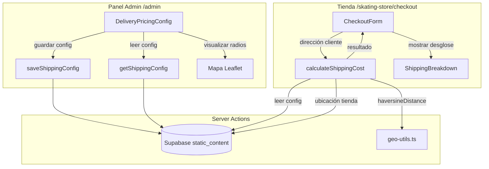

# Documento de Diseño: Tarificación Dinámica de Envío por Distancia

## Resumen

Este diseño extiende el sistema de entregas existente con un modelo de tarificación basado en radio. Actualmente, el sistema valida si la dirección del cliente está dentro de un polígono de zona de entrega. Esta extensión agrega una capa de precios por distancia: se define un radio base con tarifa fija, y para direcciones fuera del radio (pero dentro de una distancia máxima), se cobra un recargo proporcional a los kilómetros excedentes.

El sistema reutiliza la infraestructura existente:
- `haversineDistance` de `geo-utils.ts` para cálculo de distancias
- `getStoreLocation` de `zone-actions.ts` para obtener la ubicación de la tienda
- La tabla `static_content` de Supabase para almacenar la configuración
- Server actions de Next.js para la lógica de negocio
- Componentes admin existentes en `/admin/delivery-zones` como punto de integración

## Arquitectura



## Componentes e Interfaces

### 1. Módulo de Cálculo de Envío (`shipping-actions.ts`)

Nuevo archivo `src/lib/skating-store/shipping-actions.ts` con server actions para la lógica de tarificación.

**Funciones principales:**

- `getShippingConfig()`: Lee la configuración de envío desde `static_content` con slug `shipping-config`
- `saveShippingConfig(config)`: Guarda la configuración de envío validada
- `calculateShippingCost(customerLat, customerLng)`: Calcula el costo de envío completo

**Función pura de cálculo** (en `geo-utils.ts`):

- `computeShippingCost(distanceKm, config)`: Función pura que recibe la distancia y la configuración, retorna el resultado del cálculo. Se separa de la server action para facilitar testing.

### 2. Componente Admin: `DeliveryPricingConfig`

Nuevo componente en `src/components/admin/DeliveryPricingConfig.tsx` que se integra en la página existente `/admin/delivery-zones`.

**Funcionalidad:**
- Formulario con campos para Radio_Base, Tarifa_Base, Costo_Km_Adicional, Distancia_Máxima
- Toggle para habilitar/deshabilitar envíos fuera de zona
- Mapa Leaflet que muestra dos círculos concéntricos (radio base y distancia máxima) centrados en la ubicación de la tienda
- Los círculos se actualizan en tiempo real al cambiar los valores del formulario
- Validación client-side y server-side

### 3. Componente Checkout: `ShippingBreakdown`

Nuevo componente en `src/components/skating-store/checkout/ShippingBreakdown.tsx` que se integra en el `CheckoutForm` existente.

**Funcionalidad:**
- Muestra el desglose del cálculo de envío
- Para envíos "dentro de zona": distancia y tarifa base
- Para envíos "fuera de zona": distancia total, radio base, km excedentes, tarifa base, recargo, total
- Para envíos "fuera de alcance": mensaje de bloqueo con la distancia máxima permitida
- Se recalcula cuando cambian las coordenadas del cliente

### 4. Integración en Checkout

Se modifica el flujo existente en `CheckoutForm` para:
- Llamar a `calculateShippingCost` cuando se obtienen las coordenadas del cliente
- Mostrar el `ShippingBreakdown` con el resultado
- Bloquear el submit si el envío está "fuera de alcance" o si los envíos fuera de zona están deshabilitados y el cliente está fuera del radio base
- Pasar el costo de envío calculado al `handleCheckout` para incluirlo en la orden

## Modelos de Datos

### Configuración de Envío (en `static_content`)

Se almacena en la tabla existente `static_content` con slug `shipping-config`, siguiendo el mismo patrón que `store-location`:

```json
{
  "slug": "shipping-config",
  "data": {
    "base_radius_km": 5,
    "base_rate": 50,
    "cost_per_extra_km": 10,
    "max_distance_km": 20,
    "out_of_zone_enabled": true
  }
}
```

### Interfaces TypeScript

```typescript
// En src/types/skating-store.ts

interface ShippingConfig {
  base_radius_km: number;
  base_rate: number;
  cost_per_extra_km: number;
  max_distance_km: number;
  out_of_zone_enabled: boolean;
}

type ShippingZoneType = "within_zone" | "out_of_zone" | "out_of_range";

interface ShippingCostResult {
  zone_type: ShippingZoneType;
  distance_km: number;
  base_radius_km: number;
  base_rate: number;
  extra_km: number;
  extra_charge: number;
  total_cost: number;
  max_distance_km: number;
  out_of_zone_enabled: boolean;
}
```

### Función Pura de Cálculo (en `geo-utils.ts`)

```typescript
function computeShippingCost(
  distanceKm: number,
  config: ShippingConfig
): ShippingCostResult {
  const { base_radius_km, base_rate, cost_per_extra_km, max_distance_km, out_of_zone_enabled } = config;

  if (distanceKm <= base_radius_km) {
    return {
      zone_type: "within_zone",
      distance_km: distanceKm,
      base_radius_km, base_rate,
      extra_km: 0, extra_charge: 0,
      total_cost: base_rate,
      max_distance_km, out_of_zone_enabled,
    };
  }

  if (distanceKm > max_distance_km) {
    return {
      zone_type: "out_of_range",
      distance_km: distanceKm,
      base_radius_km, base_rate,
      extra_km: Math.round((distanceKm - base_radius_km) * 100) / 100,
      extra_charge: 0,
      total_cost: 0,
      max_distance_km, out_of_zone_enabled,
    };
  }

  const extraKm = Math.round((distanceKm - base_radius_km) * 100) / 100;
  const extraCharge = extraKm * cost_per_extra_km;

  return {
    zone_type: "out_of_zone",
    distance_km: distanceKm,
    base_radius_km, base_rate,
    extra_km: extraKm,
    extra_charge: extraCharge,
    total_cost: base_rate + extraCharge,
    max_distance_km, out_of_zone_enabled,
  };
}
```

### Validación de Configuración (en `geo-utils.ts`)

```typescript
function validateShippingConfig(
  config: ShippingConfig
): { valid: true } | { valid: false; error: string } {
  if (config.base_radius_km < 0) return { valid: false, error: "El radio base no puede ser negativo" };
  if (config.base_rate < 0) return { valid: false, error: "La tarifa base no puede ser negativa" };
  if (config.cost_per_extra_km < 0) return { valid: false, error: "El costo por km adicional no puede ser negativo" };
  if (config.max_distance_km < 0) return { valid: false, error: "La distancia máxima no puede ser negativa" };
  if (config.max_distance_km <= config.base_radius_km) {
    return { valid: false, error: "La distancia máxima debe ser mayor al radio base" };
  }
  return { valid: true };
}
```


## Propiedades de Correctitud

*Una propiedad es una característica o comportamiento que debe mantenerse verdadero en todas las ejecuciones válidas de un sistema — esencialmente, una declaración formal sobre lo que el sistema debe hacer. Las propiedades sirven como puente entre especificaciones legibles por humanos y garantías de correctitud verificables por máquina.*

### Propiedad 1: Clasificación correcta de zona por distancia

*Para cualquier* distancia no negativa y configuración válida (base_radius_km > 0, max_distance_km > base_radius_km), `computeShippingCost` debe retornar:
- `zone_type: "within_zone"` si distancia <= base_radius_km
- `zone_type: "out_of_zone"` si base_radius_km < distancia <= max_distance_km
- `zone_type: "out_of_range"` si distancia > max_distance_km

**Valida: Requisitos 2.1, 2.2, 2.3**

### Propiedad 2: Fórmula de precio fuera de zona

*Para cualquier* distancia y configuración válida donde base_radius_km < distancia <= max_distance_km, `computeShippingCost` debe retornar:
- `extra_km` igual a `round(distancia - base_radius_km, 2)`
- `total_cost` igual a `base_rate + (extra_km × cost_per_extra_km)`

Y cuando distancia <= base_radius_km, debe retornar `extra_km == 0` y `total_cost == base_rate`.

**Valida: Requisitos 3.1, 3.2, 3.3**

### Propiedad 3: Invariantes del cálculo de envío

*Para cualquier* distancia no negativa y configuración válida, el resultado de `computeShippingCost` debe cumplir:
- `total_cost >= 0` (no negatividad)
- `extra_km` tiene como máximo 2 decimales
- `extra_km >= 0`
- `distance_km` en el resultado es igual a la distancia de entrada

**Valida: Requisitos 3.4, 3.5**

### Propiedad 4: Validación rechaza configuraciones inválidas

*Para cualquier* `ShippingConfig` donde al menos un valor numérico (base_radius_km, base_rate, cost_per_extra_km, max_distance_km) es negativo, o donde max_distance_km <= base_radius_km, `validateShippingConfig` debe retornar `{ valid: false }`.

**Valida: Requisitos 4.4, 4.5**

### Propiedad 5: Round-trip de configuración de envío

*Para cualquier* `ShippingConfig` válida, guardar la configuración con `saveShippingConfig` y luego leerla con `getShippingConfig` debe retornar los mismos valores.

**Valida: Requisitos 4.2, 4.6**

### Propiedad 6: Bloqueo cuando envíos fuera de zona están deshabilitados

*Para cualquier* distancia mayor al radio base y configuración con `out_of_zone_enabled: false`, el resultado de `computeShippingCost` debe indicar que el envío no es permitido (zone_type no es "within_zone"), permitiendo al sistema bloquear el pedido.

**Valida: Requisitos 5.3**

## Manejo de Errores

| Escenario | Comportamiento |
|---|---|
| Coordenadas del cliente no disponibles | `calculateShippingCost` retorna error descriptivo; el checkout muestra aviso |
| Coordenadas del cliente inválidas (NaN, fuera de rango) | Validación con `validateCoordinates` existente rechaza la entrada |
| Configuración de envío no existe en BD | `getShippingConfig` retorna `null`; el checkout usa valores por defecto o muestra aviso |
| Valores negativos en configuración | `validateShippingConfig` rechaza con mensaje específico |
| Distancia máxima <= radio base | `validateShippingConfig` rechaza con mensaje específico |
| Ubicación de tienda no configurada | `calculateShippingCost` retorna error indicando que la tienda no tiene ubicación |
| Error de red al calcular envío | El checkout muestra mensaje de error y permite reintentar |
| Distancia excede máximo permitido | Se muestra mensaje informativo con la distancia máxima; se bloquea el submit |
| Envíos fuera de zona deshabilitados y cliente fuera de radio | Se muestra mensaje indicando que la dirección está fuera de cobertura |

## Estrategia de Testing

### Testing Unitario

- `computeShippingCost` con distancias específicas conocidas (dentro de zona, fuera de zona, fuera de alcance)
- `validateShippingConfig` con configuraciones inválidas específicas (valores negativos, max <= base)
- `computeShippingCost` con distancia exactamente igual al radio base (caso borde)
- `computeShippingCost` con distancia exactamente igual a la distancia máxima (caso borde)
- `computeShippingCost` con distancia 0 (cliente en la tienda)
- Integración de `calculateShippingCost` con mocks de Supabase

### Testing Basado en Propiedades

Se usará **fast-check** como librería de property-based testing para TypeScript, consistente con el spec existente de delivery-zones-tracking.

Cada test debe ejecutar un mínimo de 100 iteraciones y estar anotado con un comentario referenciando la propiedad del diseño:

```typescript
// Feature: dynamic-delivery-pricing, Property 1: Clasificación correcta de zona por distancia
```

**Propiedades a implementar como tests:**

1. **Propiedad 1**: Clasificación correcta de zona por distancia
2. **Propiedad 2**: Fórmula de precio fuera de zona
3. **Propiedad 3**: Invariantes del cálculo de envío
4. **Propiedad 4**: Validación rechaza configuraciones inválidas
5. **Propiedad 5**: Round-trip de configuración de envío (requiere mock de Supabase)
6. **Propiedad 6**: Bloqueo cuando envíos fuera de zona están deshabilitados

### Generadores para fast-check

```typescript
// Generador de ShippingConfig válida
const validShippingConfig = fc.record({
  base_radius_km: fc.float({ min: 0.1, max: 100, noNaN: true }),
  base_rate: fc.float({ min: 0, max: 10000, noNaN: true }),
  cost_per_extra_km: fc.float({ min: 0, max: 1000, noNaN: true }),
  max_distance_km: fc.float({ min: 0.2, max: 200, noNaN: true }),
  out_of_zone_enabled: fc.boolean(),
}).filter(c => c.max_distance_km > c.base_radius_km);

// Generador de distancia no negativa
const nonNegativeDistance = fc.float({ min: 0, max: 500, noNaN: true });
```

### Notas

- Los tests unitarios cubren casos específicos y edge cases (distancia = 0, distancia = radio base exacto, distancia = max exacto)
- Los tests de propiedades cubren la correctitud universal con inputs generados aleatoriamente
- Las propiedades 1-4 y 6 son funciones puras y se testean directamente sin mocks
- La propiedad 5 requiere mock de Supabase para el round-trip de persistencia
- Ambos enfoques son complementarios y necesarios para cobertura completa
