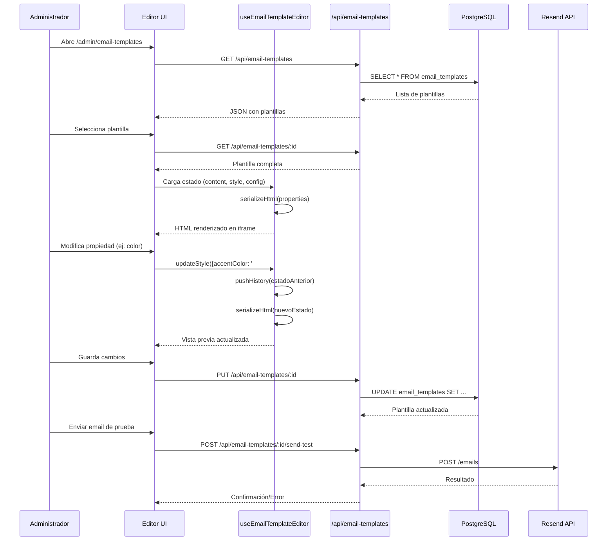

# Documento de Diseño Técnico: Editor de Plantillas de Email

## Visión General

El Editor de Plantillas de Email es un módulo integrado en el panel de administración (`/admin/email-templates`) que permite a los administradores crear, editar y gestionar plantillas HTML de correo electrónico de forma visual. Reemplaza el enfoque actual de HTML hardcodeado en el backend (como `buildPromoEmailHtml` en `promotions.ts`) con un sistema dinámico y configurable.

El módulo se compone de tres capas principales:

1. **Frontend (Next.js)**: Página de administración con editor visual de tres paneles (lista, canvas, propiedades)
2. **Backend (Express)**: API REST CRUD para plantillas + endpoint de envío de prueba vía Resend
3. **Base de datos (PostgreSQL)**: Tabla `email_templates` con campos JSONB para propiedades de contenido y estilo

### Decisiones de Diseño Clave

- **JSONB para propiedades**: Se usa JSONB en lugar de columnas individuales para `content_properties` y `style_properties`, permitiendo flexibilidad para agregar nuevos campos sin migraciones.
- **Serialización/Parsing bidireccional**: El HTML se genera a partir de las propiedades (serialización) y las propiedades se extraen del HTML (parsing), permitiendo edición tanto visual como por código.
- **Historial en memoria**: El undo/redo se implementa con un stack en el estado del cliente (no persiste en BD), manteniendo la simplicidad.
- **iframe aislado para preview**: El canvas usa un iframe para renderizar el HTML del email de forma aislada, evitando conflictos de estilos con el panel admin.

## Arquitectura

```mermaid
graph TB
    subgraph "Frontend - Next.js"
        Page["/admin/email-templates<br/>page.tsx"]
        PL[Panel Lista]
        CC[Canvas Central]
        PP[Panel Propiedades]
        
        Page --> PL
        Page --> CC
        Page --> PP
        
        subgraph "Estado del Editor"
            State[useEmailTemplateEditor<br/>hook principal]
            History[useHistoryStack<br/>undo/redo]
            Serializer[serializeHtml()]
            Parser[parseHtml()]
        end
        
        PL --> State
        CC --> State
        PP --> State
        State --> History
        State --> Serializer
        State --> Parser
    end
    
    subgraph "Backend - Express"
        Router["/api/email-templates<br/>email-templates.ts"]
        Auth[requireAuth + requireRole ADMIN]
        ResendAPI[Resend API]
        
        Router --> Auth
        Router --> ResendAPI
    end
    
    subgraph "Base de Datos - PostgreSQL"
        Table["email_templates<br/>(id, name, subject, html_content,<br/>content_properties JSONB,<br/>style_properties JSONB, ...)"]
    end
    
    State -->|fetch/mutate| Router
    Router --> Table
```

### Flujo de Datos



## Componentes e Interfaces

### Componentes Frontend

```
src/app/admin/email-templates/
  page.tsx                          # Página principal del editor
src/components/admin/email-templates/
  EmailTemplateEditor.tsx           # Componente contenedor del editor (3 paneles)
  TemplateListPanel.tsx             # Panel izquierdo: lista de plantillas
  TemplateCanvas.tsx                # Panel central: iframe preview + editor código
  PropertiesPanel.tsx               # Panel derecho: pestañas contenido/estilo/config
  ContentTab.tsx                    # Pestaña de contenido
  StyleTab.tsx                      # Pestaña de estilo
  ConfigTab.tsx                     # Pestaña de configuración
src/hooks/
  useEmailTemplateEditor.ts         # Hook principal de estado del editor
  useHistoryStack.ts                # Hook de undo/redo
src/lib/email-templates/
  serializer.ts                     # Genera HTML desde propiedades
  parser.ts                         # Extrae propiedades desde HTML
  types.ts                          # Tipos TypeScript compartidos
  variables.ts                      # Definición y reemplazo de variables
  default-template.ts               # HTML base para plantillas nuevas
```

### Interfaces TypeScript

```typescript
// src/lib/email-templates/types.ts

export type TriggerType = 'automatico-registro' | 'manual-campana' | 'evento-disparado';
export type TemplateStatus = 'activa' | 'borrador' | 'pausada';

export interface ContentProperties {
  brandName: string;
  heroLabel: string;
  title: string;
  subtitle: string;
  ctaText: string;
  ctaUrl: string;
  bodyText: string;
  footerText: string;
}

export interface StyleProperties {
  accentColor: string;
  heroBackgroundColor: string;
  titleFont: string;
  showNavigation: boolean;
  showCards: boolean;
  showBackgroundPattern: boolean;
  showSocialLinks: boolean;
}

export interface TemplateConfig {
  name: string;
  subject: string;
  senderName: string;
  replyTo: string;
  triggerType: TriggerType;
  status: TemplateStatus;
}

export interface EmailTemplate {
  id: string;
  name: string;
  subject: string;
  senderName: string;
  replyTo: string;
  htmlContent: string;
  contentProperties: ContentProperties;
  styleProperties: StyleProperties;
  triggerType: TriggerType;
  status: TemplateStatus;
  createdAt: string;
  updatedAt: string;
}

export interface EmailTemplateListItem {
  id: string;
  name: string;
  status: TemplateStatus;
  triggerType: TriggerType;
  updatedAt: string;
}

export interface TemplateVariable {
  key: string;        // ej: "nombre_usuario"
  label: string;      // ej: "Nombre del Usuario"
  exampleValue: string; // ej: "Juan Pérez"
}
```

### Hook Principal: useEmailTemplateEditor

```typescript
// src/hooks/useEmailTemplateEditor.ts

interface EditorState {
  templates: EmailTemplateListItem[];
  activeTemplate: EmailTemplate | null;
  contentProperties: ContentProperties;
  styleProperties: StyleProperties;
  config: TemplateConfig;
  htmlContent: string;
  viewMode: 'preview' | 'code';
  previewMode: 'desktop' | 'mobile';
  selectedSection: string | null;
  isDirty: boolean;
  isLoading: boolean;
}

interface EditorActions {
  loadTemplates: () => Promise<void>;
  selectTemplate: (id: string) => Promise<void>;
  createTemplate: () => Promise<void>;
  saveTemplate: () => Promise<void>;
  deleteTemplate: (id: string) => Promise<void>;
  updateContent: (partial: Partial<ContentProperties>) => void;
  updateStyle: (partial: Partial<StyleProperties>) => void;
  updateConfig: (partial: Partial<TemplateConfig>) => void;
  updateHtml: (html: string) => void;
  setViewMode: (mode: 'preview' | 'code') => void;
  setPreviewMode: (mode: 'desktop' | 'mobile') => void;
  selectSection: (sectionId: string | null) => void;
  undo: () => void;
  redo: () => void;
  canUndo: boolean;
  canRedo: boolean;
  exportHtml: () => void;
  sendTestEmail: (toEmail: string) => Promise<void>;
}
```

### Hook de Historial: useHistoryStack

```typescript
// src/hooks/useHistoryStack.ts

interface HistorySnapshot {
  contentProperties: ContentProperties;
  styleProperties: StyleProperties;
  htmlContent: string;
}

interface UseHistoryStack {
  push: (snapshot: HistorySnapshot) => void;
  undo: () => HistorySnapshot | null;
  redo: () => HistorySnapshot | null;
  canUndo: boolean;
  canRedo: boolean;
}
```

### API Backend: Rutas

```typescript
// backend/src/routes/email-templates.ts

// GET    /api/email-templates              → Lista de plantillas (metadatos)
// GET    /api/email-templates/:id          → Plantilla completa
// POST   /api/email-templates              → Crear plantilla
// PUT    /api/email-templates/:id          → Actualizar plantilla
// DELETE /api/email-templates/:id          → Eliminar plantilla
// POST   /api/email-templates/:id/send-test → Enviar email de prueba

// Todas las rutas requieren: requireAuth, requireRole("ADMIN")
// Patrón consistente con content.ts y promotions.ts existentes
```

### Serializer y Parser

```typescript
// src/lib/email-templates/serializer.ts
export function serializeHtml(
  content: ContentProperties,
  style: StyleProperties
): string;

// src/lib/email-templates/parser.ts
export function parseHtml(
  html: string
): { content: ContentProperties; style: StyleProperties };

// src/lib/email-templates/variables.ts
export const TEMPLATE_VARIABLES: TemplateVariable[];
export function replaceVariables(
  html: string,
  values: Record<string, string>
): string;
export function replaceWithExampleValues(html: string): string;
```

## Modelos de Datos

### Tabla: email_templates

```sql
-- backend/src/db/migrations/007_email_templates.sql

CREATE TABLE IF NOT EXISTS email_templates (
  id UUID PRIMARY KEY DEFAULT gen_random_uuid(),
  name VARCHAR(255) NOT NULL UNIQUE,
  subject VARCHAR(500) NOT NULL DEFAULT '',
  sender_name VARCHAR(255) NOT NULL DEFAULT '',
  reply_to VARCHAR(255) NOT NULL DEFAULT '',
  html_content TEXT NOT NULL DEFAULT '',
  content_properties JSONB NOT NULL DEFAULT '{}'::jsonb,
  style_properties JSONB NOT NULL DEFAULT '{}'::jsonb,
  trigger_type VARCHAR(50) NOT NULL DEFAULT 'manual-campana'
    CHECK (trigger_type IN ('automatico-registro', 'manual-campana', 'evento-disparado')),
  status VARCHAR(20) NOT NULL DEFAULT 'borrador'
    CHECK (status IN ('activa', 'borrador', 'pausada')),
  created_at TIMESTAMPTZ DEFAULT NOW(),
  updated_at TIMESTAMPTZ DEFAULT NOW()
);

CREATE INDEX IF NOT EXISTS idx_email_templates_status ON email_templates(status);
CREATE INDEX IF NOT EXISTS idx_email_templates_trigger ON email_templates(trigger_type);
CREATE INDEX IF NOT EXISTS idx_email_templates_updated ON email_templates(updated_at DESC);
```

### Estructura JSONB: content_properties

```json
{
  "brandName": "Hunykho Store",
  "heroLabel": "NUEVA COLECCIÓN",
  "title": "Descubre lo nuevo",
  "subtitle": "Los mejores productos te esperan",
  "ctaText": "Ver Ahora",
  "ctaUrl": "https://hunykho.com/skating-store",
  "bodyText": "Texto del cuerpo del email...",
  "footerText": "© 2024 Hunykho Store. Todos los derechos reservados."
}
```

### Estructura JSONB: style_properties

```json
{
  "accentColor": "#7c3aed",
  "heroBackgroundColor": "#1e1b4b",
  "titleFont": "Arial",
  "showNavigation": true,
  "showCards": false,
  "showBackgroundPattern": true,
  "showSocialLinks": true
}
```

### Mapeo Backend → Frontend (snake_case → camelCase)

| Columna BD | Campo TypeScript |
|---|---|
| `id` | `id` |
| `name` | `name` |
| `subject` | `subject` |
| `sender_name` | `senderName` |
| `reply_to` | `replyTo` |
| `html_content` | `htmlContent` |
| `content_properties` | `contentProperties` |
| `style_properties` | `styleProperties` |
| `trigger_type` | `triggerType` |
| `status` | `status` |
| `created_at` | `createdAt` |
| `updated_at` | `updatedAt` |


## Propiedades de Correctitud

*Una propiedad es una característica o comportamiento que debe mantenerse verdadero en todas las ejecuciones válidas de un sistema — esencialmente, una declaración formal sobre lo que el sistema debe hacer. Las propiedades sirven como puente entre especificaciones legibles por humanos y garantías de correctitud verificables por máquina.*

### Propiedad 1: Ordenamiento de lista de plantillas

*Para cualquier* conjunto de plantillas almacenadas en la base de datos, la lista retornada por GET `/api/email-templates` debe estar ordenada por `updated_at` de forma descendente (la más reciente primero).

**Valida: Requisito 1.1**

### Propiedad 2: Round-trip de persistencia de plantilla

*Para cualquier* plantilla válida con propiedades de contenido, estilo y configuración arbitrarias, guardarla vía PUT y luego cargarla vía GET debe retornar datos equivalentes a los enviados (excluyendo campos auto-generados como `updated_at`).

**Valida: Requisitos 1.4, 9.3, 9.4**

### Propiedad 3: El serializador refleja todas las propiedades en el HTML

*Para cualquier* combinación válida de `ContentProperties` y `StyleProperties`, el HTML generado por `serializeHtml()` debe: contener todos los valores de contenido no vacíos (título, subtítulo, ctaText, bodyText, footerText), aplicar el `accentColor` a los botones CTA y elementos de acento, incluir/excluir secciones según los toggles (`showNavigation`, `showCards`, `showBackgroundPattern`, `showSocialLinks`), y aplicar la `titleFont` seleccionada a los elementos de título.

**Valida: Requisitos 3.2, 4.2, 4.3, 4.4, 11.1**

### Propiedad 4: Campos de contenido vacíos se omiten del HTML

*Para cualquier* `ContentProperties` donde uno o más campos estén vacíos (string vacío), el HTML generado por `serializeHtml()` no debe contener secciones vacías ni elementos placeholder para esos campos.

**Valida: Requisito 3.3**

### Propiedad 5: Valores válidos de enumeración

*Para cualquier* plantilla, el campo `trigger_type` debe ser uno de `['automatico-registro', 'manual-campana', 'evento-disparado']` y el campo `status` debe ser uno de `['activa', 'borrador', 'pausada']`. Intentar guardar valores fuera de estos conjuntos debe resultar en un error.

**Valida: Requisitos 5.2, 5.3**

### Propiedad 6: Activación requiere campos obligatorios completos

*Para cualquier* plantilla donde al menos uno de los campos obligatorios (`name`, `subject`, `senderName`, `replyTo`, `htmlContent`) esté vacío, intentar cambiar el estado a `'activa'` debe ser rechazado y el estado debe permanecer sin cambios.

**Valida: Requisitos 5.4, 5.5**

### Propiedad 7: Round-trip de undo/redo restaura estado

*Para cualquier* secuencia de N cambios aplicados al editor, ejecutar N operaciones de undo debe restaurar el estado inicial, y luego ejecutar N operaciones de redo debe restaurar el estado final.

**Valida: Requisitos 6.1, 6.2, 6.3**

### Propiedad 8: Nuevo cambio después de undo trunca historial de redo

*Para cualquier* secuencia de cambios donde se ejecutan K operaciones de undo (K < N) y luego se realiza un nuevo cambio, la operación de redo no debe estar disponible (`canRedo` debe ser `false`).

**Valida: Requisito 6.4**

### Propiedad 9: Reemplazo completo de variables

*Para cualquier* HTML que contenga variables de plantilla (`{{nombre_variable}}`) y cualquier mapa completo de valores de reemplazo, `replaceVariables()` debe producir HTML sin ningún placeholder `{{...}}` restante.

**Valida: Requisitos 8.3, 8.4**

### Propiedad 10: Autenticación requerida en todos los endpoints

*Para cualquier* endpoint de la API `/api/email-templates/*`, una petición sin token de autenticación válido con rol ADMIN debe retornar un código de estado 401 o 403.

**Valida: Requisito 9.7**

### Propiedad 11: updated_at se actualiza al guardar

*Para cualquier* plantilla existente, después de ejecutar un PUT con datos modificados, el campo `updated_at` de la plantilla debe ser mayor o igual al timestamp inmediatamente anterior a la operación de guardado.

**Valida: Requisito 10.2**

### Propiedad 12: Unicidad del nombre de plantilla

*Para cualquier* par de plantillas en la base de datos, sus campos `name` deben ser distintos. Intentar crear o actualizar una plantilla con un nombre ya existente debe resultar en un error.

**Valida: Requisito 10.3**

### Propiedad 13: Parser extrae propiedades del HTML

*Para cualquier* HTML válido de email generado por `serializeHtml(content, style)`, `parseHtml(html)` debe retornar propiedades de contenido y estilo equivalentes a las originales.

**Valida: Requisitos 11.2, 2.3**

### Propiedad 14: HTML compatible con clientes de email

*Para cualquier* combinación de propiedades, el HTML generado por `serializeHtml()` debe usar elementos `<table>` para layout y atributos `style` inline (no `<div>` para estructura ni `<style>` en bloque como mecanismo principal de estilado).

**Valida: Requisito 11.3**

### Propiedad 15: Round-trip de serialización/parsing

*Para cualquier* `ContentProperties` y `StyleProperties` válidos, `serializeHtml(parseHtml(serializeHtml(content, style)))` debe producir HTML funcionalmente equivalente a `serializeHtml(content, style)`.

**Valida: Requisito 11.4**

## Manejo de Errores

### Errores de API (Backend)

| Escenario | Código HTTP | Respuesta |
|---|---|---|
| Token ausente o inválido | 401 | `{ error: "No autorizado" }` |
| Token válido pero no ADMIN | 403 | `{ error: "Acceso denegado" }` |
| Plantilla no encontrada | 404 | `{ error: "Plantilla no encontrada" }` |
| Nombre duplicado | 409 | `{ error: "Ya existe una plantilla con ese nombre" }` |
| Activación con campos faltantes | 422 | `{ error: "Campos obligatorios faltantes", fields: [...] }` |
| Fallo al enviar email de prueba | 502 | `{ error: "Error al enviar email de prueba", detail: "..." }` |
| Error interno del servidor | 500 | `{ error: "Error interno del servidor" }` |

### Errores de Frontend

- **Fallo de red**: Mostrar toast de error con opción de reintentar.
- **Validación de formulario**: Mostrar mensajes inline bajo los campos inválidos al intentar activar una plantilla.
- **HTML inválido en editor de código**: El parser debe manejar HTML malformado gracefully, retornando propiedades por defecto para las secciones que no pueda parsear.
- **Pérdida de cambios no guardados**: Mostrar diálogo de confirmación al intentar navegar fuera del editor con cambios sin guardar (`isDirty`).

### Estrategia de Resiliencia del Parser

El `parseHtml()` debe seguir una estrategia de "mejor esfuerzo":
1. Intentar extraer cada propiedad de forma independiente
2. Si una sección no se puede parsear, usar el valor por defecto para esa propiedad
3. Nunca lanzar excepciones — siempre retornar un objeto `ContentProperties` y `StyleProperties` válido
4. Registrar warnings en consola para secciones que no se pudieron parsear

## Estrategia de Testing

### Testing Unitario

Los tests unitarios se enfocan en ejemplos específicos, edge cases y condiciones de error:

- **Serializer**: Verificar que HTML generado con propiedades específicas contiene los elementos esperados
- **Parser**: Verificar que HTML conocido produce las propiedades esperadas
- **Variables**: Verificar reemplazo con valores de ejemplo predefinidos
- **History Stack**: Verificar comportamiento con secuencias específicas de undo/redo
- **Validación de activación**: Verificar rechazo con campos específicos vacíos
- **API endpoints**: Tests de integración con base de datos de prueba para CRUD completo

### Testing Basado en Propiedades (Property-Based Testing)

Se usará **fast-check** como librería de property-based testing para TypeScript/JavaScript.

Cada propiedad del documento de diseño se implementará como un test basado en propiedades con mínimo 100 iteraciones. Los tests se etiquetarán con el formato:

```
// Feature: email-template-editor, Property {N}: {descripción}
```

Propiedades a implementar como PBT:

| Propiedad | Generadores Necesarios |
|---|---|
| P1: Ordenamiento de lista | Generar N plantillas con timestamps aleatorios |
| P2: Persistencia round-trip | Generar ContentProperties, StyleProperties y TemplateConfig aleatorios |
| P3: Serializer refleja propiedades | Generar ContentProperties y StyleProperties aleatorios |
| P4: Campos vacíos omitidos | Generar ContentProperties con campos aleatorios vacíos |
| P5: Valores de enumeración | Generar strings aleatorios para trigger_type y status |
| P6: Activación con campos faltantes | Generar TemplateConfig con campos aleatorios vacíos |
| P7: Undo/redo round-trip | Generar secuencias aleatorias de cambios |
| P8: Truncación de historial | Generar secuencias de cambios + undos + nuevo cambio |
| P9: Reemplazo de variables | Generar HTML con variables aleatorias y valores de reemplazo |
| P12: Unicidad de nombre | Generar pares de plantillas con nombres aleatorios |
| P13: Parser extrae propiedades | Generar ContentProperties y StyleProperties, serializar, parsear |
| P14: HTML compatible email | Generar propiedades aleatorias, verificar estructura del HTML |
| P15: Round-trip serialización | Generar propiedades aleatorias, serializar → parsear → serializar |

### Configuración de Tests

- **Framework**: Vitest (consistente con el proyecto)
- **PBT Library**: fast-check
- **Iteraciones mínimas**: 100 por propiedad
- **Ubicación de tests**:
  - Unit tests: `src/lib/email-templates/__tests__/`
  - API tests: `backend/src/routes/email-templates.test.ts`
  - Property tests: `src/lib/email-templates/__tests__/*.property.test.ts`
