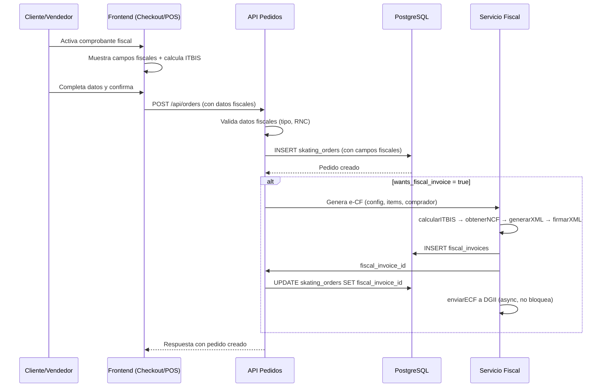

# Documento de Diseño: Integración Fiscal en Checkout y POS

## Visión General

Esta integración conecta el módulo fiscal existente (`backend/src/fiscal/`) con los flujos de creación de pedidos (checkout online y POS). El diseño se basa en extender los componentes existentes de forma mínima: agregar columnas fiscales a `skating_orders`, extender los endpoints `POST /api/orders` y `POST /api/orders/pos` para aceptar datos fiscales, y agregar controles UI en `CheckoutForm`, `OrderSummary` y `POSPayment`.

La generación del e-CF se dispara automáticamente después de crear el pedido, reutilizando toda la infraestructura fiscal existente (NCF manager, XML generator, XML signer, DGII client, audit logger).

## Arquitectura



## Componentes e Interfaces

### 1. Migración de Base de Datos

Archivo: `backend/src/db/migrations/003_fiscal_checkout_integration.sql`

```sql
ALTER TABLE skating_orders
  ADD COLUMN IF NOT EXISTS wants_fiscal_invoice BOOLEAN DEFAULT FALSE,
  ADD COLUMN IF NOT EXISTS fiscal_customer_type VARCHAR(20),
  ADD COLUMN IF NOT EXISTS fiscal_customer_rnc VARCHAR(11),
  ADD COLUMN IF NOT EXISTS fiscal_invoice_id UUID REFERENCES fiscal_invoices(id);
```

### 2. Backend - Extensión de Endpoints de Pedidos

Archivo: `backend/src/routes/orders.ts`

Se extienden `POST /api/orders` y `POST /api/orders/pos` para:
- Aceptar campos opcionales: `wants_fiscal_invoice`, `fiscal_customer_type`, `fiscal_customer_rnc`
- Validar datos fiscales cuando `wants_fiscal_invoice=true`
- Disparar generación de e-CF post-inserción

```typescript
// Función auxiliar de validación fiscal
interface FiscalOrderData {
  wants_fiscal_invoice: boolean;
  fiscal_customer_type?: 'persona_juridica' | 'persona_fisica' | 'consumidor_final';
  fiscal_customer_rnc?: string;
}

function validateFiscalData(data: FiscalOrderData): { valid: boolean; error?: string } {
  if (!data.wants_fiscal_invoice) return { valid: true };
  
  const validTypes = ['persona_juridica', 'persona_fisica', 'consumidor_final'];
  if (!data.fiscal_customer_type || !validTypes.includes(data.fiscal_customer_type)) {
    return { valid: false, error: 'Tipo de comprador fiscal inválido' };
  }
  
  if (data.fiscal_customer_type !== 'consumidor_final') {
    if (!data.fiscal_customer_rnc || !validarRNC(data.fiscal_customer_rnc)) {
      return { valid: false, error: 'RNC inválido. Debe tener 9 u 11 dígitos numéricos' };
    }
  }
  
  return { valid: true };
}
```

### 3. Backend - Función de Generación Automática de e-CF

```typescript
// Función que orquesta la generación del e-CF post-pedido
async function generateFiscalInvoiceForOrder(
  orderId: string,
  orderItems: any[],
  orderTotal: number,
  customerName: string,
  fiscalType: TipoComprador,
  fiscalRnc: string | null,
  userId: string
): Promise<string | null> {
  // 1. Obtener config fiscal
  // 2. Determinar tipo de comprobante (31 o 32)
  // 3. Construir ItemFactura[] desde orderItems
  // 4. calcularITBIS(items)
  // 5. obtenerSiguienteNCF(tipoComprobante)
  // 6. generarXML(ecfData)
  // 7. firmarXML(xml, certificado)
  // 8. INSERT fiscal_invoices
  // 9. enviarECF (no bloquea si falla)
  // 10. Retornar fiscal_invoice_id
}
```

### 4. Frontend - Componente FiscalInvoiceFields

Nuevo componente reutilizable para checkout y POS.

Archivo: `src/components/shared/FiscalInvoiceFields.tsx`

```typescript
interface FiscalInvoiceFieldsProps {
  wantsFiscalInvoice: boolean;
  onWantsFiscalInvoiceChange: (value: boolean) => void;
  customerType: TipoComprador | '';
  onCustomerTypeChange: (value: TipoComprador) => void;
  rnc: string;
  onRncChange: (value: string) => void;
  rncError?: string;
}
```

Este componente encapsula:
- Toggle "¿Desea comprobante fiscal?"
- Selector de tipo de comprador (3 opciones)
- Campo de RNC (condicional, con validación inline)

### 5. Frontend - Extensión de OrderSummary

Archivo: `src/components/skating-store/checkout/OrderSummary.tsx`

Se agrega prop `wantsFiscalInvoice: boolean`. Cuando es `true`:
- Calcula ITBIS = subtotal × 0.18
- Muestra línea "ITBIS (18%)" con el monto
- Total = subtotal + ITBIS + envío

### 6. Frontend - Extensión de CheckoutForm y Checkout Page

- `CheckoutForm` integra `FiscalInvoiceFields` y pasa los datos fiscales en `onSubmit`
- `checkout/page.tsx` pasa `wantsFiscalInvoice` a `OrderSummary` y envía datos fiscales a `createOrder`

### 7. Frontend - Extensión de POSPayment y POS Page

- `POSPayment` integra `FiscalInvoiceFields` y pasa datos fiscales en `onConfirm`
- `pos/page.tsx` recalcula total con ITBIS cuando se activa comprobante fiscal

### 8. Frontend - Extensión de createOrder y createPOSOrder

Archivo: `src/lib/skating-store/supabase-queries.ts`

```typescript
// Campos adicionales en createOrder
interface FiscalFields {
  wants_fiscal_invoice: boolean;
  fiscal_customer_type?: string;
  fiscal_customer_rnc?: string;
}
```

## Modelos de Datos

### Extensión de skating_orders

| Columna | Tipo | Default | Descripción |
|---------|------|---------|-------------|
| wants_fiscal_invoice | BOOLEAN | FALSE | Si el cliente solicitó comprobante fiscal |
| fiscal_customer_type | VARCHAR(20) | NULL | Tipo de comprador: persona_juridica, persona_fisica, consumidor_final |
| fiscal_customer_rnc | VARCHAR(11) | NULL | RNC del comprador (requerido para persona_juridica y persona_fisica) |
| fiscal_invoice_id | UUID | NULL | FK a fiscal_invoices.id, se llena post-generación del e-CF |

### Constantes de ITBIS

```typescript
const ITBIS_RATE = 0.18;

// Cálculo frontend (para display)
const itbis = Math.round(subtotal * ITBIS_RATE * 100) / 100;
const totalConITBIS = subtotal + itbis + shipping;

// Cálculo backend (para e-CF) - usa calcularITBIS existente
```

### Mapeo de Tipo Comprador → Tipo Comprobante

| Tipo Comprador | Tipo Comprobante | Código |
|---------------|-----------------|--------|
| persona_juridica | Factura de Crédito Fiscal | 31 |
| persona_fisica | Factura de Crédito Fiscal | 31 |
| consumidor_final | Factura de Consumo | 32 |


## Propiedades de Correctitud

*Una propiedad es una característica o comportamiento que debe cumplirse en todas las ejecuciones válidas de un sistema — esencialmente, una declaración formal sobre lo que el sistema debe hacer. Las propiedades sirven como puente entre especificaciones legibles por humanos y garantías de correctitud verificables por máquinas.*

### Propiedad 1: Cálculo de ITBIS correcto y redondeado

*Para cualquier* subtotal positivo, el ITBIS calculado debe ser igual a `round(subtotal × 0.18, 2)`, y el resultado debe tener máximo 2 decimales.

**Valida: Requisitos 2.1, 2.5**

### Propiedad 2: Invariante de total con y sin comprobante fiscal

*Para cualquier* subtotal ≥ 0 y costo de envío ≥ 0:
- Con comprobante fiscal: total = subtotal + round(subtotal × 0.18, 2) + envío
- Sin comprobante fiscal: total = subtotal + envío

Activar y luego desactivar el comprobante fiscal debe retornar al total original sin ITBIS.

**Valida: Requisitos 2.3, 2.4**

### Propiedad 3: Validación de datos fiscales

*Para cualquier* combinación de `(wants_fiscal_invoice, fiscal_customer_type, fiscal_customer_rnc)`, la función de validación debe aceptar si y solo si:
- `wants_fiscal_invoice` es `false`, O
- `fiscal_customer_type` es uno de `['persona_juridica', 'persona_fisica', 'consumidor_final']` Y (`fiscal_customer_type` es `'consumidor_final'` O `fiscal_customer_rnc` es un string de exactamente 9 o 11 dígitos numéricos)

**Valida: Requisitos 3.5, 3.6, 5.1, 5.2, 5.3**

### Propiedad 4: Mapeo tipo de comprador a tipo de comprobante

*Para cualquier* tipo de comprador válido, el tipo de comprobante generado debe ser:
- `'31'` (Factura de Crédito Fiscal) cuando el tipo es `persona_juridica` o `persona_fisica`
- `'32'` (Factura de Consumo) cuando el tipo es `consumidor_final`

**Valida: Requisitos 6.4**

### Propiedad 5: Persistencia round-trip de datos fiscales en pedido

*Para cualquier* pedido con datos fiscales válidos (wants_fiscal_invoice=true, tipo y RNC válidos), después de insertar y luego consultar el pedido, los campos `wants_fiscal_invoice`, `fiscal_customer_type` y `fiscal_customer_rnc` deben ser iguales a los valores originales.

**Valida: Requisitos 5.4**

### Propiedad 6: Requerimiento condicional de RNC

*Para cualquier* tipo de comprador, el RNC es requerido si y solo si el tipo NO es `consumidor_final`. Es decir:
- `requiresRnc('persona_juridica')` = true
- `requiresRnc('persona_fisica')` = true
- `requiresRnc('consumidor_final')` = false

**Valida: Requisitos 3.3, 3.4**

### Propiedad 7: Consistencia de validación RNC entre frontend y backend

*Para cualquier* string arbitrario, la función de validación de RNC del frontend y la función `validarRNC` del backend deben retornar el mismo resultado booleano.

**Valida: Requisitos 7.2**

## Manejo de Errores

| Escenario | Comportamiento |
|-----------|---------------|
| RNC inválido en frontend | Mostrar error inline, bloquear envío del formulario |
| RNC inválido en backend | Retornar HTTP 400 con mensaje descriptivo |
| Tipo de comprador inválido | Retornar HTTP 400 con mensaje descriptivo |
| Fallo en generación de e-CF | Loguear error, completar pedido sin fiscal_invoice_id, no bloquear transacción |
| Config fiscal no encontrada | Loguear error, completar pedido sin e-CF |
| Certificado digital no configurado | Loguear error, completar pedido sin e-CF |
| Secuencia NCF agotada | Loguear error, completar pedido sin e-CF |
| DGII no disponible | e-CF queda en estado `pendiente_envio` para reintento posterior (comportamiento existente) |

## Estrategia de Testing

### Librería de Property-Based Testing

Se usará `fast-check` con `vitest` (ya configurados en el proyecto).

### Tests de Propiedades (Property-Based Tests)

Cada propiedad del documento se implementará como un test individual con mínimo 100 iteraciones:

- **Propiedad 1**: Generar subtotales aleatorios (fc.float), verificar cálculo de ITBIS
- **Propiedad 2**: Generar pares (subtotal, envío), verificar invariante de total
- **Propiedad 3**: Generar combinaciones aleatorias de (boolean, string, string), verificar función de validación
- **Propiedad 4**: Generar tipos de comprador aleatorios, verificar mapeo a tipo de comprobante
- **Propiedad 5**: Generar datos fiscales válidos, insertar pedido, consultar y comparar
- **Propiedad 6**: Generar tipos de comprador, verificar requerimiento de RNC
- **Propiedad 7**: Generar strings aleatorios, comparar resultado de validación frontend vs backend

Tag format: `Feature: fiscal-checkout-integration, Property N: [título]`

### Tests Unitarios

Los tests unitarios complementan las propiedades cubriendo:

- Ejemplos específicos de cálculo de ITBIS (ej: subtotal=1000 → ITBIS=180)
- Caso edge: subtotal=0 → ITBIS=0
- Caso edge: consumidor_final sin RNC → válido
- Caso edge: fallo del servicio fiscal no bloquea creación de pedido
- Integración: endpoint POST /api/orders con datos fiscales retorna 201
- Integración: endpoint POST /api/orders con RNC inválido retorna 400
