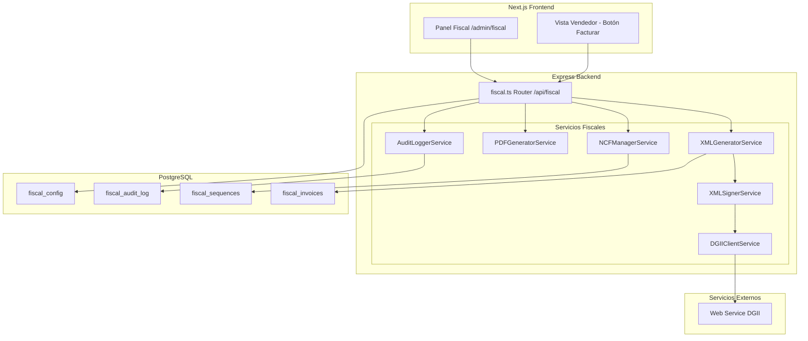
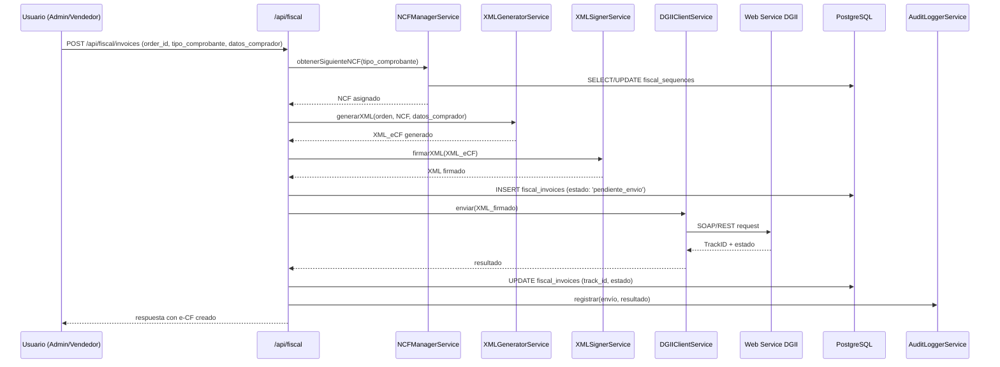
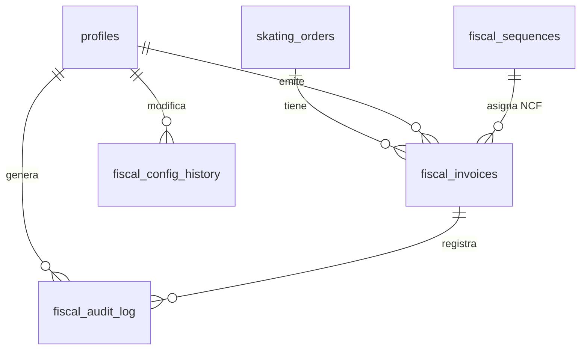

# Documento de Diseño: Módulo de Facturación Fiscal (e-CF DGII)

## Visión General

El módulo de facturación fiscal se implementa como un componente separado dentro de la arquitectura existente del proyecto (Express backend + Next.js frontend). Se compone de:

- **Backend**: Nuevas rutas Express (`/api/fiscal/*`) con servicios dedicados para generación XML, firma digital, comunicación con DGII y gestión de secuencias.
- **Frontend**: Nuevo panel de administración fiscal en `/admin/fiscal` dentro de la app Next.js existente.
- **Base de datos**: Nuevas tablas PostgreSQL para comprobantes fiscales, secuencias, configuración del emisor, certificados y logs de auditoría.

El diseño prioriza la separación de responsabilidades: cada operación fiscal (generar XML, firmar, enviar, almacenar) es un servicio independiente que puede probarse y mantenerse de forma aislada.

## Arquitectura



### Flujo Principal de Emisión



## Componentes e Interfaces

### 1. XMLGeneratorService

Responsable de construir el documento XML del e-CF conforme al esquema XSD de la DGII.

```typescript
interface ECFData {
  ncf: string;
  tipoComprobante: TipoComprobante;
  emisor: DatosEmisor;
  comprador: DatosComprador;
  items: ItemFactura[];
  subtotal: number;
  totalITBIS: number;
  total: number;
  fechaEmision: Date;
  ordenId: string;
}

interface XMLGeneratorService {
  generarXML(data: ECFData): string;
  validarContraXSD(xml: string): ValidationResult;
  formatearXML(xml: string): string;
  parsearXML(xml: string): ECFData;
}
```

### 2. XMLSignerService

Aplica firma digital XMLDSig al documento XML usando el certificado configurado.

```typescript
interface XMLSignerService {
  firmarXML(xml: string, certificado: CertificadoConfig): string;
  verificarFirma(xmlFirmado: string): boolean;
}

interface CertificadoConfig {
  archivoP12: Buffer;
  password: string;
}
```

### 3. DGIIClientService

Gestiona la comunicación con el Web Service de la DGII, incluyendo envío, consulta de estado y anulación.

```typescript
type EstadoDGII = 'Aceptado' | 'Rechazado' | 'AceptadoCondicional' | 'EnProceso' | 'Anulado';

interface DGIIResponse {
  trackId: string;
  estado: EstadoDGII;
  mensajes: string[];
}

interface DGIIClientService {
  enviarECF(xmlFirmado: string): Promise<DGIIResponse>;
  consultarEstado(trackId: string): Promise<DGIIResponse>;
  enviarAnulacion(xmlAnulacion: string): Promise<DGIIResponse>;
}
```

### 4. NCFManagerService

Gestiona las secuencias de números de comprobantes fiscales, garantizando unicidad y secuencialidad.

```typescript
type TipoComprobante = 
  | '31' // Factura de Crédito Fiscal
  | '32' // Factura de Consumo
  | '33' // Nota de Débito
  | '34' // Nota de Crédito
  | '41' // Compras
  | '43' // Gastos Menores
  | '44' // Regímenes Especiales
  | '45' // Gubernamental
  | '46' // Exportaciones
  | '47'; // Pagos al Exterior

interface SecuenciaFiscal {
  id: string;
  tipoComprobante: TipoComprobante;
  prefijo: string;
  rangoInicial: number;
  rangoFinal: number;
  numeroActual: number;
  fechaVencimiento: Date;
  estado: 'activa' | 'agotada' | 'vencida';
}

interface NCFManagerService {
  obtenerSiguienteNCF(tipo: TipoComprobante): Promise<string>;
  verificarDisponibilidad(tipo: TipoComprobante): Promise<{ disponibles: number; porcentajeUso: number }>;
  registrarSecuencia(secuencia: Omit<SecuenciaFiscal, 'id' | 'estado'>): Promise<SecuenciaFiscal>;
}
```

### 5. PDFGeneratorService

Genera la representación impresa del e-CF en formato PDF con código QR.

```typescript
interface PDFGeneratorService {
  generarPDF(invoice: FiscalInvoice): Promise<Buffer>;
}
```

### 6. AuditLoggerService

Registra todas las operaciones fiscales para trazabilidad y auditoría.

```typescript
type TipoEventoAuditoria = 
  | 'ecf_generado'
  | 'ecf_firmado'
  | 'ecf_enviado'
  | 'ecf_estado_actualizado'
  | 'ecf_anulado'
  | 'acuse_recibido'
  | 'aprobacion_comercial'
  | 'secuencia_creada'
  | 'secuencia_alerta'
  | 'certificado_cargado'
  | 'config_actualizada'
  | 'config_historial_creado';

interface AuditLoggerService {
  registrar(evento: TipoEventoAuditoria, datos: Record<string, unknown>, usuarioId: string): Promise<void>;
}
```

### 7. Rutas API (fiscal.ts Router)

```
POST   /api/fiscal/invoices              - Generar e-CF desde una orden
GET    /api/fiscal/invoices              - Listar e-CF con filtros
GET    /api/fiscal/invoices/:id          - Detalle de un e-CF
POST   /api/fiscal/invoices/:id/resend   - Reenviar e-CF rechazado
POST   /api/fiscal/invoices/:id/annul    - Anular e-CF
GET    /api/fiscal/invoices/:id/pdf      - Descargar PDF
POST   /api/fiscal/invoices/:id/ack      - Registrar acuse de recibo
POST   /api/fiscal/invoices/:id/approval - Registrar aprobación comercial

GET    /api/fiscal/sequences             - Listar secuencias fiscales
POST   /api/fiscal/sequences             - Crear secuencia fiscal
GET    /api/fiscal/sequences/status      - Estado de uso de secuencias

GET    /api/fiscal/config                - Obtener configuración fiscal
PUT    /api/fiscal/config                - Actualizar configuración fiscal
POST   /api/fiscal/config/certificate    - Cargar certificado digital
GET    /api/fiscal/config/history        - Historial de cambios de configuración

GET    /api/fiscal/dashboard             - Resumen para panel fiscal
GET    /api/fiscal/audit-log             - Log de auditoría
```

## Modelos de Datos

### Tabla: fiscal_invoices

```sql
CREATE TABLE fiscal_invoices (
  id UUID PRIMARY KEY DEFAULT gen_random_uuid(),
  order_id UUID REFERENCES skating_orders(id),
  ncf VARCHAR(19) UNIQUE NOT NULL,
  tipo_comprobante VARCHAR(2) NOT NULL,
  
  -- Datos del comprador
  comprador_rnc VARCHAR(11),
  comprador_nombre VARCHAR(255) NOT NULL,
  comprador_tipo VARCHAR(20) NOT NULL CHECK (comprador_tipo IN ('persona_juridica', 'persona_fisica', 'consumidor_final')),
  
  -- Montos
  subtotal DECIMAL(12,2) NOT NULL,
  total_itbis DECIMAL(12,2) NOT NULL,
  total DECIMAL(12,2) NOT NULL,
  
  -- XML
  xml_original TEXT NOT NULL,
  xml_firmado TEXT,
  
  -- Estado DGII
  track_id VARCHAR(100),
  estado_dgii VARCHAR(30) DEFAULT 'pendiente_envio' 
    CHECK (estado_dgii IN ('pendiente_envio', 'enviado', 'aceptado', 'rechazado', 'aceptado_condicional', 'en_proceso', 'anulado')),
  motivo_rechazo TEXT,
  intentos_envio INTEGER DEFAULT 0,
  
  -- Acuse y aprobación
  acuse_recibido BOOLEAN DEFAULT FALSE,
  acuse_fecha TIMESTAMPTZ,
  aprobacion_comercial BOOLEAN DEFAULT FALSE,
  aprobacion_fecha TIMESTAMPTZ,
  
  -- Metadata
  emitido_por UUID REFERENCES profiles(id),
  created_at TIMESTAMPTZ DEFAULT NOW(),
  updated_at TIMESTAMPTZ DEFAULT NOW()
);

CREATE INDEX idx_fiscal_invoices_order ON fiscal_invoices(order_id);
CREATE INDEX idx_fiscal_invoices_ncf ON fiscal_invoices(ncf);
CREATE INDEX idx_fiscal_invoices_estado ON fiscal_invoices(estado_dgii);
CREATE INDEX idx_fiscal_invoices_tipo ON fiscal_invoices(tipo_comprobante);
CREATE INDEX idx_fiscal_invoices_fecha ON fiscal_invoices(created_at);
```

### Tabla: fiscal_sequences

```sql
CREATE TABLE fiscal_sequences (
  id UUID PRIMARY KEY DEFAULT gen_random_uuid(),
  tipo_comprobante VARCHAR(2) NOT NULL,
  prefijo VARCHAR(3) NOT NULL,
  rango_inicial INTEGER NOT NULL,
  rango_final INTEGER NOT NULL,
  numero_actual INTEGER NOT NULL,
  fecha_vencimiento DATE NOT NULL,
  estado VARCHAR(10) DEFAULT 'activa' CHECK (estado IN ('activa', 'agotada', 'vencida')),
  created_at TIMESTAMPTZ DEFAULT NOW(),
  updated_at TIMESTAMPTZ DEFAULT NOW(),
  UNIQUE(tipo_comprobante, prefijo, rango_inicial)
);
```

### Tabla: fiscal_config

```sql
CREATE TABLE fiscal_config (
  id UUID PRIMARY KEY DEFAULT gen_random_uuid(),
  rnc_emisor VARCHAR(11) NOT NULL,
  razon_social VARCHAR(255) NOT NULL,
  nombre_comercial VARCHAR(255),
  direccion_fiscal TEXT NOT NULL,
  telefono VARCHAR(20),
  correo VARCHAR(255),
  
  -- Conexión DGII
  dgii_ws_url_pruebas TEXT,
  dgii_ws_url_produccion TEXT,
  ambiente VARCHAR(10) DEFAULT 'pruebas' CHECK (ambiente IN ('pruebas', 'produccion')),
  
  -- Certificado digital (cifrado)
  certificado_p12 BYTEA,
  certificado_password_encrypted TEXT,
  certificado_valido_hasta DATE,
  
  updated_at TIMESTAMPTZ DEFAULT NOW()
);
```

### Tabla: fiscal_config_history

```sql
CREATE TABLE fiscal_config_history (
  id UUID PRIMARY KEY DEFAULT gen_random_uuid(),
  config_snapshot JSONB NOT NULL,
  campos_modificados TEXT[] NOT NULL,
  modificado_por UUID REFERENCES profiles(id),
  created_at TIMESTAMPTZ DEFAULT NOW()
);

CREATE INDEX idx_fiscal_config_history_fecha ON fiscal_config_history(created_at);
```

### Tabla: fiscal_audit_log

```sql
CREATE TABLE fiscal_audit_log (
  id UUID PRIMARY KEY DEFAULT gen_random_uuid(),
  evento VARCHAR(50) NOT NULL,
  invoice_id UUID REFERENCES fiscal_invoices(id) ON DELETE SET NULL,
  usuario_id UUID REFERENCES profiles(id),
  datos JSONB DEFAULT '{}',
  created_at TIMESTAMPTZ DEFAULT NOW()
);

CREATE INDEX idx_fiscal_audit_evento ON fiscal_audit_log(evento);
CREATE INDEX idx_fiscal_audit_invoice ON fiscal_audit_log(invoice_id);
CREATE INDEX idx_fiscal_audit_fecha ON fiscal_audit_log(created_at);
```

### Relación con tablas existentes




## Propiedades de Correctitud

*Una propiedad es una característica o comportamiento que debe mantenerse verdadero en todas las ejecuciones válidas de un sistema — esencialmente, una declaración formal sobre lo que el sistema debe hacer. Las propiedades sirven como puente entre especificaciones legibles por humanos y garantías de correctitud verificables por máquinas.*

### Property 1: Generación de XML produce documentos válidos contra XSD

*Para cualquier* conjunto válido de datos de factura (ECFData), el XML generado por XMLGeneratorService.generarXML() debe pasar la validación contra el esquema XSD de la DGII sin errores.

**Validates: Requirements 1.1, 1.6**

### Property 2: Cálculo correcto de ITBIS

*Para cualquier* lista de ítems con montos gravados positivos, el total de ITBIS calculado debe ser exactamente igual al 18% del subtotal gravado (redondeado a 2 decimales), y el total debe ser igual a subtotal + totalITBIS.

**Validates: Requirements 1.3**

### Property 3: Tipo de comprador determina contenido del documento

*Para cualquier* e-CF generado, si el comprador es persona jurídica entonces el XML debe contener el campo RNC del comprador; si el comprador es consumidor final entonces el tipo de comprobante debe ser '32' y el campo RNC del comprador debe estar ausente.

**Validates: Requirements 1.4, 1.5**

### Property 4: Unicidad y secuencialidad de NCF

*Para cualquier* secuencia de N asignaciones de NCF del mismo tipo de comprobante, cada NCF asignado debe ser estrictamente mayor que el anterior, y no debe haber duplicados en el conjunto completo de NCFs asignados.

**Validates: Requirements 1.2, 4.2**

### Property 5: Validez de firma digital

*Para cualquier* XML válido de e-CF, al firmarlo con un certificado válido, el resultado debe contener los elementos XMLDSig requeridos (SignedInfo, SignatureValue, KeyInfo) y la firma debe ser verificable con la clave pública del certificado.

**Validates: Requirements 2.1, 2.2**

### Property 6: Rechazo de certificado inválido

*Para cualquier* certificado digital que esté expirado o sea inválido, la operación de firma debe fallar con un error descriptivo que indique la razón del fallo, y el XML no debe ser modificado.

**Validates: Requirements 2.3**

### Property 7: Round-trip de cifrado de certificado

*Para cualquier* contraseña de certificado digital, cifrar con AES-256 y luego descifrar debe producir la contraseña original. Además, el texto cifrado no debe ser igual al texto plano.

**Validates: Requirements 2.4, 8.3**

### Property 8: Mapeo correcto de estados DGII

*Para cualquier* respuesta válida de la DGII con un estado (Aceptado, Rechazado, AceptadoCondicional, EnProceso), el estado almacenado en la base de datos del e-CF debe corresponder exactamente al mapeo definido para ese estado.

**Validates: Requirements 3.2**

### Property 9: Completitud del log de auditoría

*Para cualquier* operación fiscal (envío, anulación, actualización de estado), debe existir un registro en el log de auditoría que contenga: tipo de evento, ID de factura, ID de usuario, fecha/hora, y datos relevantes de la operación.

**Validates: Requirements 3.5, 7.4**

### Property 10: Alerta de agotamiento de secuencia al 80%

*Para cualquier* secuencia fiscal, cuando el porcentaje de uso alcanza o supera el 80%, el sistema debe generar una alerta. Cuando el uso es menor al 80%, no debe generarse alerta.

**Validates: Requirements 4.3**

### Property 11: Secuencia agotada o vencida bloquea emisión

*Para cualquier* secuencia fiscal con estado 'agotada' o 'vencida', solicitar un nuevo NCF de ese tipo de comprobante debe resultar en un error y no debe asignarse ningún número.

**Validates: Requirements 4.4**

### Property 12: URL del QR contiene parámetros requeridos

*Para cualquier* e-CF válido, la URL generada para el código QR debe contener el NCF del comprobante y el RNC del emisor como parámetros.

**Validates: Requirements 5.2**

### Property 13: Actualización de estado por acuse y aprobación

*Para cualquier* e-CF existente, al registrar un acuse de recibo, el campo acuse_recibido debe ser true y acuse_fecha debe contener la fecha del registro. Al registrar una aprobación comercial, el campo aprobacion_comercial debe ser true y aprobacion_fecha debe contener la fecha.

**Validates: Requirements 6.1, 6.2**

### Property 14: Detección de acuse vencido

*Para cualquier* e-CF con más de 10 días calendario desde su emisión y sin acuse de recibo, el sistema debe marcarlo como pendiente de acuse.

**Validates: Requirements 6.3**

### Property 15: Rechazo de anulación duplicada

*Para cualquier* e-CF con estado 'anulado', intentar anularlo nuevamente debe resultar en un error y el estado debe permanecer sin cambios.

**Validates: Requirements 7.3**

### Property 16: e-CF almacenado contiene XML y referencia a orden

*Para cualquier* e-CF creado, el registro en la base de datos debe contener xml_original no vacío, y el order_id debe referenciar una orden existente en skating_orders.

**Validates: Requirements 8.1**

### Property 17: Acceso restringido a datos fiscales

*Para cualquier* usuario con rol diferente a ADMIN, las solicitudes a los endpoints fiscales deben retornar un error de autorización (403).

**Validates: Requirements 8.4**

### Property 18: Round-trip de serialización XML

*Para cualquier* objeto ECFData válido, serializar a XML con generarXML() y luego deserializar con parsearXML() debe producir un objeto equivalente al original.

**Validates: Requirements 9.3**

### Property 19: Filtros retornan solo facturas coincidentes

*Para cualquier* conjunto de e-CF y cualquier combinación de filtros (rango de fechas, estado, tipo de comprobante), todos los resultados retornados deben cumplir con todos los filtros aplicados simultáneamente, y ningún e-CF que cumpla los filtros debe ser excluido.

**Validates: Requirements 10.2**

### Property 20: Conteos del dashboard coinciden con datos reales

*Para cualquier* conjunto de e-CF en la base de datos, los conteos por estado mostrados en el dashboard deben sumar exactamente el total de e-CF, y cada conteo individual debe coincidir con la cantidad real de e-CF en ese estado.

**Validates: Requirements 10.4**

### Property 21: Validación de formato RNC

*Para cualquier* string, la validación de RNC debe aceptar únicamente strings compuestos de exactamente 9 o 11 dígitos numéricos, y rechazar cualquier otro formato.

**Validates: Requirements 11.4**

### Property 22: Validación de expiración de certificado

*Para cualquier* certificado digital, si la fecha de expiración es anterior a la fecha actual, el sistema debe rechazar la carga del certificado. Si la fecha de expiración es futura, debe aceptarlo.

**Validates: Requirements 11.5**

## Manejo de Errores

### Errores de Comunicación con DGII

| Escenario | Comportamiento |
|---|---|
| Web Service no disponible | Encolar para reintento (máx. 5 intentos, espera exponencial: 1s, 2s, 4s, 8s, 16s) |
| Timeout de conexión | Tratar como no disponible, encolar para reintento |
| e-CF rechazado | Almacenar motivo de rechazo, marcar como 'rechazado', permitir corrección y reenvío |
| Respuesta malformada | Registrar en log de auditoría, marcar como error, notificar al administrador |

### Errores de Secuencias Fiscales

| Escenario | Comportamiento |
|---|---|
| Secuencia agotada | Bloquear emisión del tipo, notificar administrador |
| Secuencia vencida | Bloquear emisión del tipo, notificar administrador |
| Secuencia al 80% | Generar alerta preventiva, permitir emisión |

### Errores de Certificado Digital

| Escenario | Comportamiento |
|---|---|
| Certificado expirado | Rechazar firma, notificar administrador con fecha de expiración |
| Certificado inválido | Rechazar firma, mostrar error descriptivo |
| Contraseña incorrecta | Rechazar carga, informar al usuario |
| Archivo no es .p12 | Rechazar carga, informar formato esperado |

### Errores de Validación

| Escenario | Comportamiento |
|---|---|
| XML no válido contra XSD | Rechazar generación, retornar errores de validación específicos |
| RNC formato inválido | Rechazar configuración, informar formato esperado (9 u 11 dígitos) |
| Orden no encontrada | Retornar 404 con mensaje descriptivo |
| Anulación duplicada | Retornar 409 (conflicto) con mensaje informativo |

## Estrategia de Testing

### Enfoque Dual

El módulo utiliza dos tipos de testing complementarios:

1. **Tests unitarios**: Verifican ejemplos específicos, casos borde y condiciones de error
2. **Tests de propiedades (PBT)**: Verifican propiedades universales con entradas generadas aleatoriamente

### Librería de Property-Based Testing

Se utilizará **fast-check** para TypeScript, que es la librería PBT más madura del ecosistema Node.js.

```bash
npm install --save-dev fast-check
```

### Configuración de Tests de Propiedades

- Mínimo 100 iteraciones por test de propiedad
- Cada test debe referenciar la propiedad del documento de diseño
- Formato de tag: **Feature: fiscal-invoicing-module, Property {N}: {título}**

### Generadores Personalizados (Arbitraries)

Se necesitarán generadores para:

- `ECFData`: Datos completos de factura fiscal con ítems, montos y datos de comprador válidos
- `TipoComprobante`: Uno de los tipos válidos ('31', '32', '33', etc.)
- `DatosComprador`: Con variantes para persona jurídica, persona física y consumidor final
- `ItemFactura`: Ítems con nombres, cantidades y precios válidos
- `RNC`: Strings de exactamente 9 u 11 dígitos
- `SecuenciaFiscal`: Secuencias con diferentes niveles de uso y estados
- `DGIIResponse`: Respuestas simuladas de la DGII con diferentes estados

### Cobertura de Tests

| Componente | Unit Tests | Property Tests |
|---|---|---|
| XMLGeneratorService | Ejemplos de XML generado, casos borde | P1, P2, P3, P18 |
| XMLSignerService | Firma con certificado de prueba | P5, P6 |
| NCFManagerService | Asignación básica, secuencia agotada | P4, P10, P11 |
| DGIIClientService | Mock de respuestas, reintentos | P8 |
| PDFGeneratorService | Generación básica de PDF | P12 |
| AuditLoggerService | Registro de eventos | P9 |
| Cifrado de certificado | Cifrado/descifrado básico | P7 |
| Filtros y dashboard | Filtrado básico | P19, P20 |
| Validaciones | RNC válido/inválido, certificado | P21, P22 |
| Autorización | Acceso por rol | P17 |
| Acuse/Aprobación | Registro básico | P13, P14 |
| Anulación | Flujo básico, duplicado | P15 |
| Almacenamiento | e-CF con XML y orden | P16 |
