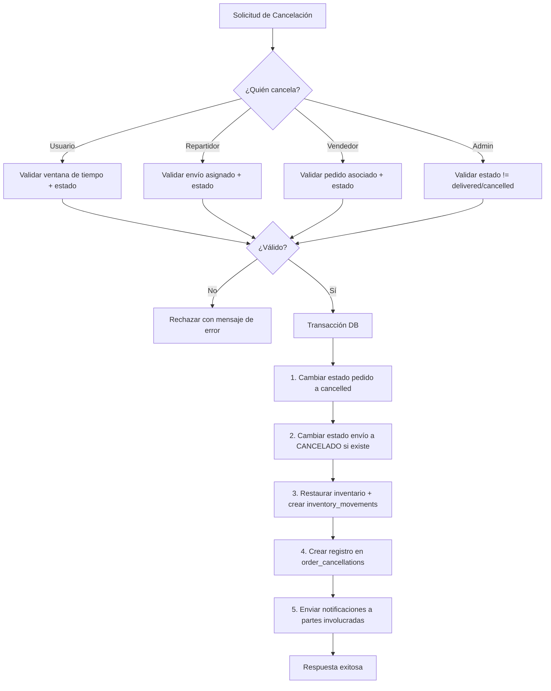
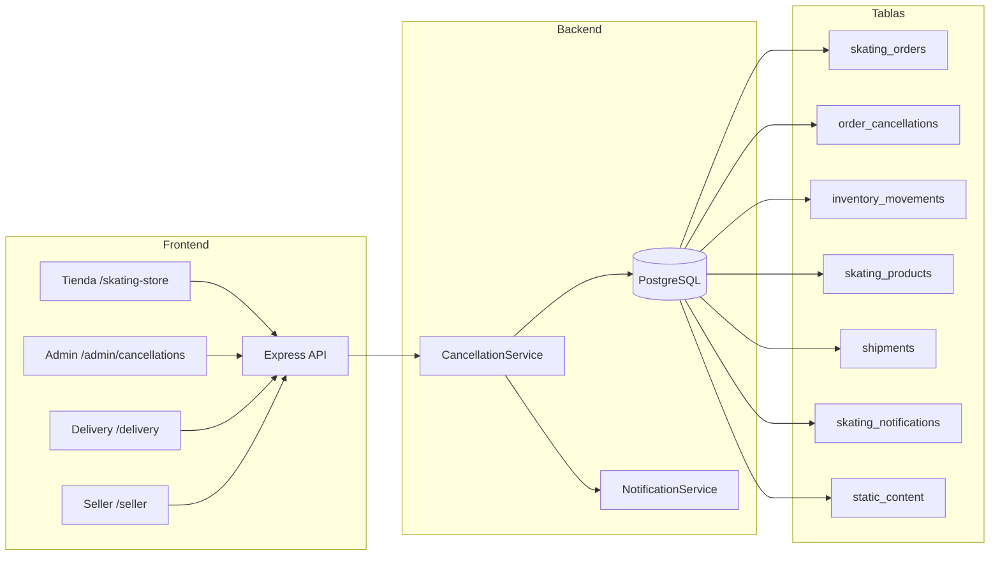

# Documento de Diseño: Cancelación de Pedidos

## Resumen

Este documento describe el diseño técnico del sistema de cancelación de pedidos para la tienda de patinaje. El sistema permite a usuarios, repartidores, vendedores y administradores cancelar pedidos bajo condiciones específicas, con restauración automática de inventario, notificaciones a todas las partes involucradas y un registro auditable en una tabla dedicada `order_cancellations`.

El diseño se integra con la arquitectura existente: backend Express/Node.js con PostgreSQL, frontend Next.js con App Router, autenticación JWT con roles (`USER`, `ADMIN`, `DELIVERY`, `SELLER`), y el sistema de notificaciones existente (`skating_notifications`).

## Arquitectura

### Diagrama de Flujo de Cancelación



### Diagrama de Componentes



## Componentes e Interfaces

### 1. Backend: Ruta de Cancelaciones (`backend/src/routes/cancellations.ts`)

Nueva ruta Express que centraliza toda la lógica de cancelación. Se registra en `index.ts` como `/api/cancellations`.

#### Endpoints

| Método | Ruta | Rol | Descripción |
|--------|------|-----|-------------|
| `POST` | `/api/orders/:id/cancel` | USER | Cancelar pedido propio (dentro de ventana) |
| `POST` | `/api/cancellations/delivery/:orderId` | DELIVERY | Cancelar pedido asignado |
| `POST` | `/api/cancellations/seller/:orderId` | SELLER | Cancelar pedido asociado |
| `POST` | `/api/cancellations/admin/:orderId` | ADMIN | Cancelar cualquier pedido |
| `GET` | `/api/cancellations` | ADMIN | Listar cancelaciones con filtros |
| `GET` | `/api/cancellations/config` | ADMIN | Obtener configuración de ventana |
| `PUT` | `/api/cancellations/config` | ADMIN | Actualizar ventana de cancelación |

#### Decisión de diseño: Ruta separada vs. extender orders.ts

Se opta por crear una ruta separada `cancellations.ts` en lugar de extender `orders.ts` porque:
- La cancelación involucra lógica compleja (validación por rol, restauración de inventario, notificaciones, registro de auditoría) que haría `orders.ts` demasiado grande
- El endpoint existente `POST /api/orders/:id/cancel` se reemplazará con la nueva lógica mejorada directamente en `orders.ts` para mantener compatibilidad con el frontend existente
- Los endpoints específicos de repartidor, vendedor y admin se agrupan en `/api/cancellations/`

### 2. Servicio de Cancelación (`backend/src/lib/cancellation-service.ts`)

Módulo que encapsula la lógica de negocio de cancelación, reutilizable desde cualquier ruta.

```typescript
interface CancelOrderParams {
  orderId: string;
  cancelledBy: string;       // UUID del usuario que cancela
  cancelledByRole: 'USER' | 'DELIVERY' | 'SELLER' | 'ADMIN';
  reasonCode: string;        // Código del motivo predefinido
  reasonDescription?: string; // Descripción adicional (requerida para "Otro")
}

interface CancelOrderResult {
  success: boolean;
  order: Order;
  cancellation: OrderCancellation;
  inventoryRestored: boolean;
  notificationsSent: number;
}
```

Funciones principales:
- `cancelOrder(params: CancelOrderParams): Promise<CancelOrderResult>` — Ejecuta toda la cancelación en una transacción
- `validateCancellation(orderId, userId, role): Promise<ValidationResult>` — Valida permisos y condiciones
- `getCancellationWindow(): Promise<number>` — Obtiene la ventana configurada en minutos
- `restoreInventory(client, order): Promise<void>` — Restaura stock dentro de la transacción
- `sendCancellationNotifications(order, cancellation): Promise<void>` — Envía notificaciones a todas las partes

### 3. Frontend: Componentes de Cancelación

#### 3.1 Modal de Cancelación (`src/components/shared/CancelOrderModal.tsx`)

Componente reutilizable que muestra un diálogo de confirmación con selector de motivo. Se adapta según el rol del usuario:
- Para USER: motivos genéricos ("Pedido por error", "Ya no lo necesito", "Encontré mejor precio", "Otro")
- Para DELIVERY: "Cliente no presente", "Cliente no paga", "No es posible llegar al destino", "Otro"
- Para SELLER: "Cliente no paga", "Cliente desestima la compra", "Producto no disponible", "Otro"
- Para ADMIN: campo de texto libre

Cuando se selecciona "Otro", se muestra un textarea que requiere mínimo 10 caracteres.

#### 3.2 Panel de Cancelaciones Admin (`src/app/admin/cancellations/page.tsx`)

Nueva página en el panel de administración que muestra:
- Tabla con todas las cancelaciones (id pedido, fecha, rol, nombre, motivo)
- Filtros por rol del solicitante y rango de fechas
- Paginación

#### 3.3 Configuración de Ventana (`src/app/admin/settings/page.tsx`)

Se extiende la página de configuración existente para incluir un campo numérico para la ventana de cancelación en minutos (rango 5-1440, default 30).

### 4. Migración de Base de Datos (`backend/src/db/migrations/007_order_cancellations.sql`)

Nueva migración que crea la tabla `order_cancellations` y agrega el estado `CANCELADO` al check constraint de `shipments`.


## Modelos de Datos

### Nueva Tabla: `order_cancellations`

```sql
CREATE TABLE IF NOT EXISTS order_cancellations (
  id UUID PRIMARY KEY DEFAULT gen_random_uuid(),
  order_id UUID NOT NULL REFERENCES skating_orders(id) ON DELETE CASCADE,
  cancelled_by UUID NOT NULL REFERENCES profiles(id),
  cancelled_by_role VARCHAR(20) NOT NULL CHECK (cancelled_by_role IN ('USER', 'DELIVERY', 'SELLER', 'ADMIN')),
  reason_code VARCHAR(50) NOT NULL,
  reason_description TEXT,
  created_at TIMESTAMPTZ DEFAULT NOW()
);

CREATE INDEX IF NOT EXISTS idx_order_cancellations_order ON order_cancellations(order_id);
CREATE INDEX IF NOT EXISTS idx_order_cancellations_role ON order_cancellations(cancelled_by_role);
CREATE INDEX IF NOT EXISTS idx_order_cancellations_date ON order_cancellations(created_at);
CREATE UNIQUE INDEX IF NOT EXISTS idx_order_cancellations_unique_order ON order_cancellations(order_id);
```

### Modificación a `shipments`

Se agrega `'CANCELADO'` al check constraint de la columna `status`:

```sql
ALTER TABLE shipments DROP CONSTRAINT IF EXISTS shipments_status_check;
ALTER TABLE shipments ADD CONSTRAINT shipments_status_check 
  CHECK (status IN ('ASIGNADO', 'EN_RUTA', 'CERCA', 'ENTREGADO', 'CANCELADO'));
```

### Configuración de Ventana de Cancelación

Se almacena en la tabla existente `static_content` con slug `'site-settings'`, agregando el campo `cancellation_window_minutes` al JSON existente. Valor por defecto: 30 minutos.

```typescript
// Estructura del JSON en static_content para 'site-settings'
{
  carousel_speed: number,
  flash_sale_end: string,
  cancellation_window_minutes: number  // nuevo campo, default 30
}
```

### Códigos de Motivo de Cancelación

| Código | Rol | Descripción |
|--------|-----|-------------|
| `user_error` | USER | Pedido por error |
| `user_not_needed` | USER | Ya no lo necesito |
| `user_better_price` | USER | Encontré mejor precio |
| `user_other` | USER | Otro (requiere descripción) |
| `delivery_absent` | DELIVERY | Cliente no presente |
| `delivery_no_pay` | DELIVERY | Cliente no paga |
| `delivery_unreachable` | DELIVERY | No es posible llegar al destino |
| `delivery_other` | DELIVERY | Otro (requiere descripción) |
| `seller_no_pay` | SELLER | Cliente no paga |
| `seller_dismissed` | SELLER | Cliente desestima la compra |
| `seller_unavailable` | SELLER | Producto no disponible |
| `seller_other` | SELLER | Otro (requiere descripción) |
| `admin_custom` | ADMIN | Motivo personalizado (siempre requiere descripción) |

### Flujo de Transacción de Cancelación

Toda la cancelación se ejecuta dentro de `withTransaction` para garantizar atomicidad:

```typescript
await withTransaction(async (client) => {
  // 1. Verificar estado actual del pedido (SELECT FOR UPDATE para evitar race conditions)
  // 2. Cambiar estado del pedido a 'cancelled'
  // 3. Si existe envío, cambiar estado a 'CANCELADO'
  // 4. Para cada item del pedido:
  //    a. Verificar que el producto existe
  //    b. Restaurar stock: UPDATE skating_products SET stock = stock + quantity
  //    c. Crear inventory_movement con tipo 'in' y razón "Cancelación - Pedido #XXXX"
  // 5. Insertar registro en order_cancellations
});

// 6. Enviar notificaciones (fuera de la transacción para no bloquear)
```

### Lógica de Validación por Rol

| Rol | Condiciones para cancelar |
|-----|--------------------------|
| USER | Pedido propio + estado "pending" + dentro de ventana de cancelación |
| DELIVERY | Envío asignado al repartidor + estado envío "ASIGNADO" o "EN_RUTA" |
| SELLER | Pedido asociado al vendedor + estado != "delivered" y != "cancelled" |
| ADMIN | Estado != "delivered" y != "cancelled" |


## Propiedades de Correctitud

*Una propiedad es una característica o comportamiento que debe mantenerse verdadero en todas las ejecuciones válidas de un sistema — esencialmente, una declaración formal sobre lo que el sistema debe hacer. Las propiedades sirven como puente entre especificaciones legibles por humanos y garantías de correctitud verificables por máquina.*

### Propiedad 1: Cancelación válida transiciona el pedido a "cancelled"

*Para cualquier* pedido y *para cualquier* rol (USER, DELIVERY, SELLER, ADMIN) que cumpla las condiciones de validación correspondientes a su rol, ejecutar la cancelación debe resultar en que el estado del pedido sea "cancelled".

**Valida: Requisitos 1.2, 3.4, 5.4**

### Propiedad 2: Código de motivo requerido para toda cancelación

*Para cualquier* solicitud de cancelación sin un `reason_code` válido (o vacío), el sistema debe rechazar la solicitud y el estado del pedido debe permanecer sin cambios.

**Valida: Requisitos 1.3, 2.2, 3.2, 5.5**

### Propiedad 3: Motivo "Otro" requiere descripción de al menos 10 caracteres

*Para cualquier* solicitud de cancelación con un código de motivo que termine en `_other` o sea `admin_custom`, si la descripción tiene menos de 10 caracteres o está ausente, el sistema debe rechazar la solicitud.

**Valida: Requisitos 2.3, 3.3**

### Propiedad 4: Ventana de cancelación expirada rechaza cancelación de usuario

*Para cualquier* pedido en estado "pending" donde el tiempo transcurrido desde `created_at` excede la ventana de cancelación configurada, una solicitud de cancelación por parte del usuario debe ser rechazada y el estado del pedido debe permanecer "pending".

**Valida: Requisitos 1.4**

### Propiedad 5: Estados inválidos rechazan cancelación

*Para cualquier* pedido en estado "delivered" o "cancelled", y *para cualquier* rol, una solicitud de cancelación debe ser rechazada y el estado del pedido debe permanecer sin cambios. Adicionalmente, para envíos en estado "ENTREGADO" o "CANCELADO", la cancelación por repartidor debe ser rechazada.

**Valida: Requisitos 1.5, 2.6**

### Propiedad 6: Vendedor solo puede cancelar pedidos propios

*Para cualquier* vendedor y *para cualquier* pedido que no esté asociado a su `seller_id`, una solicitud de cancelación debe ser rechazada con error de permisos.

**Valida: Requisitos 3.6**

### Propiedad 7: Cancelación por repartidor también cancela el envío

*Para cualquier* cancelación exitosa por parte de un repartidor, el estado del envío asociado debe cambiar a "CANCELADO" además de que el estado del pedido cambie a "cancelled".

**Valida: Requisitos 2.4**

### Propiedad 8: Conservación de inventario en cancelación

*Para cualquier* pedido cancelado y *para cada* producto existente en el pedido, el stock después de la cancelación debe ser igual al stock antes de la cancelación más la cantidad del producto en el pedido.

**Valida: Requisitos 4.1, 4.4**

### Propiedad 9: Movimientos de inventario creados por restauración

*Para cualquier* cancelación que restaura inventario, *para cada* producto restaurado debe existir un registro en `inventory_movements` con `movement_type = 'in'` y `reason` que contenga el identificador del pedido y el texto "Cancelación".

**Valida: Requisitos 4.2**

### Propiedad 10: Validación de rango de ventana de cancelación

*Para cualquier* valor de ventana de cancelación fuera del rango [5, 1440], el sistema debe rechazar la actualización. *Para cualquier* valor dentro del rango [5, 1440], el sistema debe aceptar la actualización.

**Valida: Requisitos 7.4**

### Propiedad 11: Notificaciones enviadas a destinatarios correctos con contenido completo

*Para cualquier* cancelación exitosa, el usuario propietario del pedido debe recibir una notificación. Si el pedido tiene envío asignado y no fue cancelado por el repartidor, el repartidor debe recibir notificación. Si el pedido tiene vendedor asociado y no fue cancelado por el vendedor, el vendedor debe recibir notificación. Cada notificación debe contener el identificador corto del pedido, el rol de quien canceló y el motivo.

**Valida: Requisitos 6.1, 6.2, 6.3, 6.4**

### Propiedad 12: Filtros de cancelaciones retornan solo registros coincidentes

*Para cualquier* filtro por rol aplicado a la lista de cancelaciones, todos los registros retornados deben tener el `cancelled_by_role` igual al filtro. *Para cualquier* filtro por rango de fechas, todos los registros retornados deben tener `created_at` dentro del rango especificado.

**Valida: Requisitos 5.2, 5.3**

### Propiedad 13: Integridad referencial y completitud de registros de cancelación

*Para todo* pedido con estado "cancelled" en `skating_orders`, debe existir exactamente un registro correspondiente en `order_cancellations` que contenga: `order_id`, `cancelled_by`, `cancelled_by_role`, `reason_code` y `created_at` no nulos. Los registros deben estar ordenados por fecha descendente al consultarlos.

**Valida: Requisitos 8.1, 8.2, 8.3**

## Manejo de Errores

### Errores de Validación (HTTP 400)

| Escenario | Mensaje |
|-----------|---------|
| Pedido fuera de ventana de cancelación | "El período de cancelación ha expirado" |
| Pedido en estado no cancelable | "El pedido se encuentra en estado {status} y no puede ser cancelado" |
| Motivo de cancelación no proporcionado | "Debe seleccionar un motivo de cancelación" |
| Descripción insuficiente para "Otro" | "La descripción debe tener al menos 10 caracteres" |
| Ventana fuera de rango [5, 1440] | "La ventana de cancelación debe estar entre 5 y 1440 minutos" |

### Errores de Autorización (HTTP 403)

| Escenario | Mensaje |
|-----------|---------|
| Usuario intenta cancelar pedido ajeno | "No puedes cancelar este pedido" |
| Vendedor intenta cancelar pedido no asociado | "No tiene permiso para cancelar este pedido" |
| Repartidor intenta cancelar envío no asignado | "Este pedido no está asignado a tu cuenta" |

### Errores de Servidor (HTTP 500)

- Fallo en transacción de base de datos: rollback automático, log del error, respuesta genérica
- Producto eliminado durante restauración de inventario: se omite la restauración para ese producto, se registra advertencia en logs del servidor, la cancelación continúa

### Manejo de Concurrencia

Se utiliza `SELECT ... FOR UPDATE` dentro de la transacción para bloquear el registro del pedido y evitar cancelaciones duplicadas o race conditions entre múltiples solicitudes simultáneas.

## Estrategia de Testing

### Testing Unitario

Tests unitarios para casos específicos y edge cases:

- Cancelación exitosa por cada rol con datos concretos
- Rechazo de cancelación con ventana expirada (ejemplo: pedido creado hace 31 minutos con ventana de 30)
- Rechazo de cancelación de pedido en estado "delivered"
- Restauración de inventario con producto eliminado (edge case 4.3)
- Valor por defecto de ventana de cancelación (30 minutos) cuando no hay configuración
- Notificación no enviada al repartidor cuando él mismo cancela
- Formato correcto del mensaje de notificación

### Testing Basado en Propiedades

Se utilizará `fast-check` como librería de property-based testing para TypeScript/Node.js.

Cada test de propiedad debe:
- Ejecutar un mínimo de 100 iteraciones
- Referenciar la propiedad del documento de diseño con un comentario en formato: `Feature: order-cancellation, Property {número}: {título}`
- Implementarse como un ÚNICO test por propiedad

Tests de propiedad a implementar:

1. **Feature: order-cancellation, Property 1: Cancelación válida transiciona el pedido a cancelled** — Generar pedidos aleatorios con estados y roles válidos, verificar transición
2. **Feature: order-cancellation, Property 2: Código de motivo requerido** — Generar solicitudes sin reason_code, verificar rechazo
3. **Feature: order-cancellation, Property 3: Motivo "Otro" requiere descripción >= 10 chars** — Generar descripciones de longitud variable con motivos "other", verificar validación
4. **Feature: order-cancellation, Property 4: Ventana expirada rechaza cancelación** — Generar pedidos con tiempos aleatorios fuera de ventana, verificar rechazo
5. **Feature: order-cancellation, Property 5: Estados inválidos rechazan cancelación** — Generar pedidos con estados terminales, verificar rechazo para todos los roles
6. **Feature: order-cancellation, Property 6: Vendedor solo cancela pedidos propios** — Generar pares vendedor-pedido con seller_id no coincidente, verificar rechazo
7. **Feature: order-cancellation, Property 7: Cancelación por repartidor cancela envío** — Generar cancelaciones de repartidor, verificar estado de envío
8. **Feature: order-cancellation, Property 8: Conservación de inventario** — Generar pedidos con items aleatorios, cancelar, verificar stock_antes + cantidad == stock_después
9. **Feature: order-cancellation, Property 9: Movimientos de inventario creados** — Generar cancelaciones, verificar existencia de inventory_movements con tipo y razón correctos
10. **Feature: order-cancellation, Property 10: Validación de rango de ventana** — Generar valores aleatorios, verificar aceptación dentro de [5,1440] y rechazo fuera
11. **Feature: order-cancellation, Property 11: Notificaciones correctas** — Generar cancelaciones con diferentes combinaciones de rol/envío/vendedor, verificar destinatarios y contenido
12. **Feature: order-cancellation, Property 12: Filtros retornan registros coincidentes** — Generar datos de cancelaciones y filtros aleatorios, verificar que todos los resultados coincidan
13. **Feature: order-cancellation, Property 13: Integridad referencial** — Generar secuencias de cancelaciones, verificar correspondencia 1:1 entre pedidos cancelados y registros en order_cancellations
