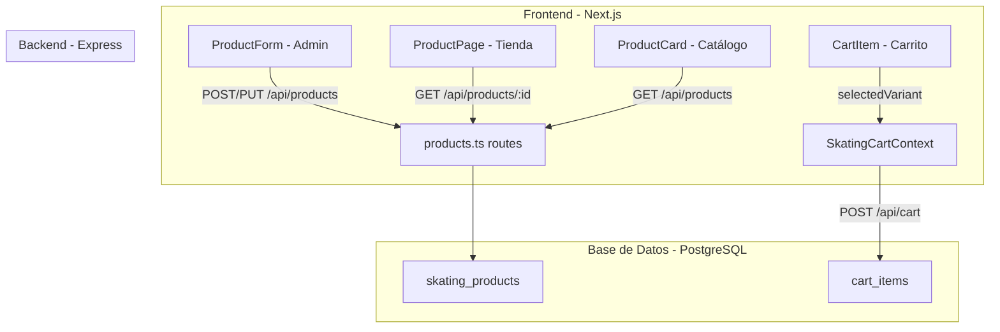
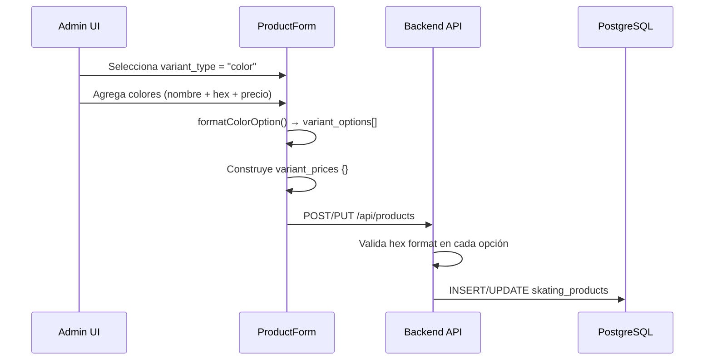
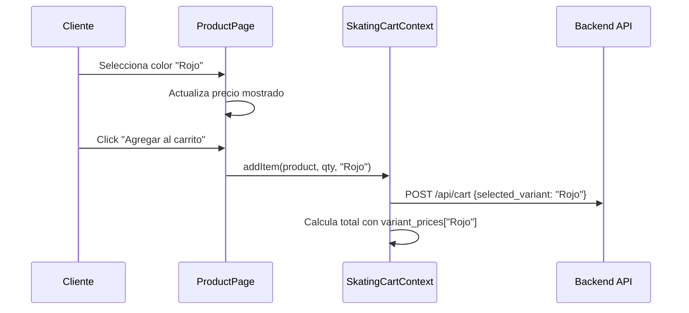

# Documento de Diseño: Variantes de Color para Productos

## Resumen

Esta funcionalidad extiende el sistema de variantes de producto existente (`variant_type: 'size' | 'measurement'`) para soportar un nuevo tipo `color`. Los colores se definen con un nombre legible y un código hexadecimal, se almacenan en los campos existentes `variant_options` (text[]) y `variant_prices` (JSONB), y se presentan visualmente como círculos de color tanto en el catálogo como en la página de detalle del producto.

No se requieren cambios en el esquema de base de datos (no se agregan columnas nuevas). El formato de almacenamiento usa la convención `"NombreColor:#HexCode"` dentro de `variant_options`, y el nombre del color como clave en `variant_prices`.

## Arquitectura

La funcionalidad se integra en la arquitectura existente sin introducir nuevas capas:



### Decisiones de Diseño

1. **Sin migración de BD**: Se reutilizan los campos existentes `variant_type`, `variant_options` y `variant_prices`. Solo se amplía el CHECK/validación para aceptar `'color'` como valor de `variant_type`.
2. **Formato compuesto en variant_options**: Se usa `"NombreColor:#HexCode"` para empaquetar nombre y hex en un solo string, evitando agregar columnas o tablas nuevas.
3. **Validación en frontend y backend**: El código hexadecimal se valida con regex `/^#[0-9A-Fa-f]{6}$/` en ambos lados.
4. **Funciones utilitarias de parseo**: Se crean helpers `parseColorOption` y `formatColorOption` para encapsular la lógica de conversión del formato compuesto.

## Componentes e Interfaces

### Nuevos Componentes

#### 1. `ColorVariantEditor` (Admin)
- **Ubicación**: `src/components/admin/ColorVariantEditor.tsx`
- **Responsabilidad**: Gestionar la lista de colores en el formulario de producto admin.
- **Props**:
  ```typescript
  interface ColorVariantEditorProps {
    colors: ColorOption[];
    basePrice: number;
    prices: Record<string, number>;
    onChange: (colors: ColorOption[], prices: Record<string, number>) => void;
  }
  ```
- **Comportamiento**: Permite agregar/eliminar colores con nombre + hex + vista previa. Inicializa precio con el precio base. Valida formato hex.

#### 2. `ColorPicker` (Tienda)
- **Ubicación**: `src/components/skating-store/products/ColorPicker.tsx`
- **Responsabilidad**: Mostrar círculos de color seleccionables en la página de producto.
- **Props**:
  ```typescript
  interface ColorPickerProps {
    colors: ColorOption[];
    selectedColor: string | null;
    onSelect: (colorName: string) => void;
  }
  ```
- **Comportamiento**: Renderiza círculos con el color hex. Muestra borde/ring al seleccionar. Muestra nombre del color seleccionado.

#### 3. `ColorDots` (Catálogo)
- **Ubicación**: `src/components/skating-store/products/ColorDots.tsx`
- **Responsabilidad**: Mostrar mini-círculos de color en la tarjeta de producto.
- **Props**:
  ```typescript
  interface ColorDotsProps {
    colors: ColorOption[];
    maxVisible?: number; // default 5
  }
  ```
- **Comportamiento**: Muestra hasta `maxVisible` círculos pequeños. Si hay más, muestra "+N".

### Componentes Modificados

#### `ProductForm` (Admin)
- Agregar `"color"` al enum de `variant_type` en el schema zod.
- Cuando `variant_type === 'color'`, renderizar `ColorVariantEditor` en lugar del input de texto actual.
- Al guardar, convertir `ColorOption[]` a formato `variant_options` string[] y `variant_prices` Record.
- Al cargar, parsear `variant_options` de vuelta a `ColorOption[]`.

#### `ProductActions` (Tienda)
- Cuando `variant_type === 'color'`, renderizar `ColorPicker` en lugar de los botones de talla/medida.
- Actualizar el precio mostrado al seleccionar un color.
- Validar selección de color antes de agregar al carrito.

#### `ProductCard` (Catálogo)
- Cuando `variant_type === 'color'`, renderizar `ColorDots` debajo del nombre del producto.

#### `CartItem` (Carrito)
- Cuando `variant_type === 'color'`, mostrar un círculo pequeño con el hex del color junto al nombre de la variante.
- Requiere parsear el hex desde `variant_options` del producto.

#### Tipo `Product` (types)
- Extender `variant_type` para incluir `'color'`: `'none' | 'size' | 'measurement' | 'color'`.

### Funciones Utilitarias

```typescript
// src/lib/skating-store/color-utils.ts

interface ColorOption {
  name: string;
  hex: string;
}

/** Parsea "Rojo:#FF0000" → { name: "Rojo", hex: "#FF0000" } */
function parseColorOption(option: string): ColorOption | null

/** Formatea { name: "Rojo", hex: "#FF0000" } → "Rojo:#FF0000" */
function formatColorOption(color: ColorOption): string

/** Valida formato hexadecimal "#RRGGBB" */
function isValidHex(hex: string): boolean

/** Extrae ColorOption[] desde variant_options string[] */
function parseColorOptions(options: string[]): ColorOption[]

/** Obtiene el hex de un color por nombre desde variant_options */
function getColorHex(options: string[], colorName: string): string | null
```

## Modelos de Datos

### Almacenamiento en BD (sin cambios de esquema)

La tabla `skating_products` ya tiene los campos necesarios:

| Campo | Tipo | Uso para colores |
|-------|------|-----------------|
| `variant_type` | `VARCHAR(20)` | Valor `'color'` |
| `variant_options` | `TEXT[]` | `["Rojo:#FF0000", "Azul:#0000FF"]` |
| `variant_prices` | `JSONB` | `{"Rojo": 59.99, "Azul": 64.99}` |

### Migración Requerida

Archivo: `backend/src/db/migrations/007_color_variant_type.sql`

```sql
-- Permitir 'color' como valor de variant_type
-- No se necesita ALTER TABLE ya que variant_type es VARCHAR(20) sin CHECK constraint
-- Solo se documenta el nuevo valor válido: 'none', 'size', 'measurement', 'color'
```

Nota: El campo `variant_type` es `VARCHAR(20)` sin constraint CHECK, por lo que no se necesita migración DDL. Sin embargo, se crea el archivo de migración como documentación y para actualizar la validación del schema zod en el frontend.

### Validación Zod Actualizada

```typescript
// En ProductForm
variant_type: z.enum(["none", "size", "measurement", "color"]),
```

### Flujo de Datos: Guardar Producto con Colores



### Flujo de Datos: Agregar al Carrito




## Propiedades de Correctitud

*Una propiedad es una característica o comportamiento que debe mantenerse verdadero en todas las ejecuciones válidas de un sistema — esencialmente, una declaración formal sobre lo que el sistema debe hacer. Las propiedades sirven como puente entre especificaciones legibles por humanos y garantías de correctitud verificables por máquina.*

### Propiedad 1: Round-trip de formato/parseo de opciones de color

*Para cualquier* `ColorOption` válido (nombre no vacío, hex válido de 7 caracteres), formatear con `formatColorOption` y luego parsear con `parseColorOption` debe producir un objeto equivalente al original.

**Valida: Requisitos 3.1, 3.2, 3.4**

### Propiedad 2: Validación rechaza hex inválidos y nombres vacíos

*Para cualquier* string que no cumpla el patrón `/^#[0-9A-Fa-f]{6}$/`, la función `isValidHex` debe retornar `false`. *Para cualquier* `ColorOption` con nombre vacío o hex inválido, la validación del formulario debe rechazar el guardado.

**Valida: Requisitos 2.6, 3.3**

### Propiedad 3: Precio inicial de color igual al precio base

*Para cualquier* producto con precio base P y cualquier color nuevo agregado, el precio inicial asignado a ese color en `variant_prices` debe ser igual a P.

**Valida: Requisito 2.3**

### Propiedad 4: Eliminar un color lo remueve de la lista y sus precios

*Para cualquier* lista de colores y cualquier color en esa lista, al eliminarlo, la lista resultante no debe contener ese color y `variant_prices` no debe contener una entrada con ese nombre.

**Valida: Requisito 2.5**

### Propiedad 5: Resolución de precio usa precio de variante o precio base como fallback

*Para cualquier* producto con variantes de color y cualquier color seleccionado, el precio resuelto debe ser `variant_prices[colorName]` si existe, o `product.price` en caso contrario.

**Valida: Requisitos 4.4, 5.5, 7.3**

### Propiedad 6: Rango de precios es min-max de variant_prices

*Para cualquier* producto con variantes de color y al menos dos precios distintos en `variant_prices`, el rango mostrado debe ser `[min(variant_prices), max(variant_prices)]`.

**Valida: Requisitos 4.5, 6.3**

### Propiedad 7: Carrito requiere selección de color para productos con variantes de color

*Para cualquier* producto con `variant_type === 'color'` y `variant_options` no vacío, intentar agregar al carrito sin `selectedVariant` debe ser rechazado.

**Valida: Requisito 5.1**

### Propiedad 8: Nombre del color se propaga a selectedVariant en carrito y pedidos

*Para cualquier* producto con variantes de color y cualquier color seleccionado, el campo `selectedVariant` del ítem en carrito/pedido debe contener exactamente el nombre del color (no el formato compuesto "Nombre:#Hex").

**Valida: Requisitos 5.2, 7.1**

### Propiedad 9: Truncamiento de puntos de color a maxVisible

*Para cualquier* lista de N colores y un valor maxVisible M, el componente `ColorDots` debe mostrar `min(N, M)` círculos. Si N > M, debe mostrar un indicador "+{N - M}".

**Valida: Requisito 6.2**

### Propiedad 10: Descripción de factura incluye nombre del color

*Para cualquier* ítem de pedido con variante de color, la descripción generada para la factura debe contener el nombre del color seleccionado.

**Valida: Requisito 7.4**

## Manejo de Errores

| Escenario | Comportamiento Esperado |
|-----------|------------------------|
| Hex inválido en admin | Mostrar error inline "Formato esperado: #RRGGBB" y prevenir guardado |
| Nombre de color vacío | Mostrar error inline "El nombre del color es requerido" |
| Nombre de color duplicado | Prevenir adición y mostrar toast de advertencia |
| Color no seleccionado al agregar al carrito | Toast de error "Por favor selecciona un color" |
| `variant_options` con formato corrupto | `parseColorOption` retorna `null`, el color se omite silenciosamente |
| Precio de variante faltante en `variant_prices` | Fallback al precio base del producto |
| Error de red al guardar producto | Toast de error genérico, formulario mantiene estado |

## Estrategia de Testing

### Librería de Property-Based Testing

Se usará **fast-check** (`fc`) para TypeScript/JavaScript, que es la librería estándar de PBT para el ecosistema Node.js/TypeScript.

### Tests Unitarios

Los tests unitarios cubren ejemplos específicos, edge cases y condiciones de error:

- `color-utils.test.ts`: Parseo de formatos válidos e inválidos, edge cases (caracteres especiales en nombres, hex en mayúsculas/minúsculas)
- `ColorVariantEditor.test.tsx`: Renderizado condicional, interacciones de agregar/eliminar colores
- `ColorPicker.test.tsx`: Selección de color, renderizado de círculos
- `ColorDots.test.tsx`: Truncamiento visual, indicador "+N"
- `CartItem.test.tsx`: Mostrar indicador de color en carrito

### Tests de Propiedades (Property-Based)

Cada propiedad de correctitud se implementa como un **único** test de propiedades con mínimo 100 iteraciones. Cada test debe referenciar la propiedad del diseño con un comentario:

```
// Feature: product-color-variants, Property 1: Round-trip de formato/parseo de opciones de color
```

Formato de tag: **Feature: product-color-variants, Property {número}: {texto de la propiedad}**

Los tests de propiedades se enfocan en:
- Round-trip de serialización/deserialización de colores (Propiedad 1)
- Validación de hex con inputs generados aleatoriamente (Propiedad 2)
- Lógica de resolución de precios con productos y colores aleatorios (Propiedad 5)
- Cálculo de rango de precios (Propiedad 6)
- Truncamiento de ColorDots con listas de tamaño variable (Propiedad 9)

### Configuración

- Mínimo 100 iteraciones por test de propiedad
- Generadores personalizados para `ColorOption` (nombre alfanumérico + hex válido)
- Tests ubicados en `src/__tests__/color-variants/`
