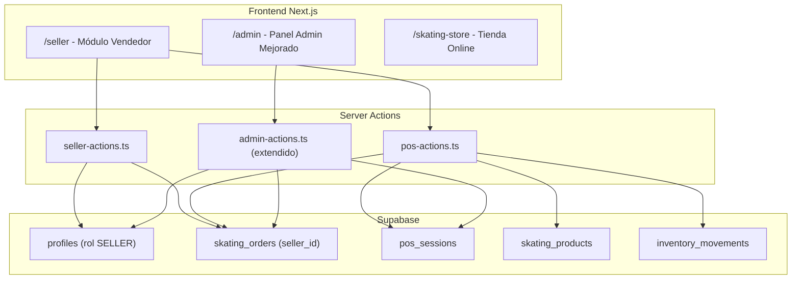
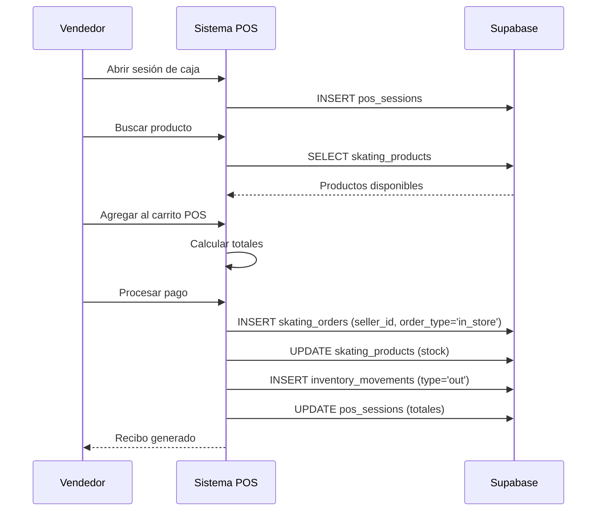

# Documento de Diseño: Sistema de Vendedor y Punto de Venta

## Visión General

Este diseño extiende la aplicación Next.js existente de la tienda de skating para incorporar un sistema de vendedores con punto de venta (POS). Se introduce un nuevo rol `SELLER` en el sistema de autenticación, un módulo dedicado para vendedores en `/seller`, funcionalidad de caja registradora para ventas presenciales, y mejoras al dashboard administrativo para monitorear rendimiento de vendedores y repartidores.

El sistema reutiliza la infraestructura existente de Supabase (tablas `skating_orders`, `skating_products`, `profiles`, `inventory_movements`, `shipments`) y la extiende con nuevas tablas para sesiones de caja y la relación vendedor-pedido.

## Arquitectura



### Flujo de Datos Principal



## Componentes e Interfaces

### 1. Módulo de Autenticación (Extensión)

Se extiende el `AuthContext` existente para soportar el rol `SELLER`:

```typescript
// Extensión de AuthContext
interface AuthContextType {
  // ... campos existentes
  isSeller: boolean;  // nuevo
}
```

Se actualiza el constraint de la tabla `profiles` para incluir `SELLER`:
```sql
CHECK (role IN ('USER', 'ADMIN', 'DELIVERY', 'SELLER'))
```

### 2. Layout del Vendedor (`/seller`)

Nueva ruta `/seller` con layout protegido similar a `/admin` y `/delivery`:

- `src/app/seller/layout.tsx` — Layout con sidebar y verificación de rol SELLER
- `src/app/seller/page.tsx` — Dashboard del vendedor
- `src/app/seller/pos/page.tsx` — Punto de venta / caja
- `src/app/seller/orders/page.tsx` — Historial de pedidos
- `src/components/seller/SellerSidebar.tsx` — Navegación lateral
- `src/components/seller/POSCart.tsx` — Carrito del punto de venta
- `src/components/seller/POSProductSearch.tsx` — Búsqueda de productos en POS
- `src/components/seller/POSPayment.tsx` — Procesamiento de pago
- `src/components/seller/POSReceipt.tsx` — Generación de recibo
- `src/components/seller/CashSessionManager.tsx` — Apertura/cierre de caja

### 3. Server Actions

```typescript
// src/lib/skating-store/seller-actions.ts
export async function getSellerDashboardStats(): Promise<SellerDashboardStats>
export async function getSellerOrders(filters?: OrderFilters): Promise<Order[]>
export async function markOrderAsDispatched(orderId: string): Promise<void>

// src/lib/skating-store/pos-actions.ts
export async function openCashSession(initialAmount: number): Promise<PosSession>
export async function closeCashSession(sessionId: string, reportedAmount: number): Promise<CashSessionSummary>
export async function createPOSOrder(items: POSCartItem[], payment: PaymentInfo, customerName: string, customerPhone?: string): Promise<Order>
export async function searchProductsForPOS(query: string): Promise<Product[]>
```

### 4. Extensión del Panel Admin

- `src/app/admin/sellers/page.tsx` — Gestión de vendedores
- Extensión de `src/app/admin/page.tsx` — Métricas de vendedores y repartidores
- Extensión de `src/components/admin/Sidebar.tsx` — Nuevo enlace "Vendedores"

```typescript
// Extensión de admin-actions.ts
export async function getSellerStats(dateRange?: DateRange): Promise<SellerStat[]>
export async function getDeliveryStats(dateRange?: DateRange): Promise<DeliveryStat[]>
export async function getSalesComparison(dateRange?: DateRange): Promise<SalesComparison>
export async function assignOrderToSeller(orderId: string, sellerId: string): Promise<void>
```

## Modelos de Datos

### Nuevas Tablas

```sql
-- Sesiones de caja
CREATE TABLE pos_sessions (
  id UUID PRIMARY KEY DEFAULT gen_random_uuid(),
  seller_id UUID REFERENCES profiles(id) NOT NULL,
  initial_amount DECIMAL(10,2) NOT NULL DEFAULT 0,
  reported_amount DECIMAL(10,2),
  expected_amount DECIMAL(10,2),
  total_sales DECIMAL(10,2) DEFAULT 0,
  total_card_sales DECIMAL(10,2) DEFAULT 0,
  total_cash_sales DECIMAL(10,2) DEFAULT 0,
  transaction_count INTEGER DEFAULT 0,
  status VARCHAR(20) DEFAULT 'open' CHECK (status IN ('open', 'closed')),
  opened_at TIMESTAMP WITH TIME ZONE DEFAULT NOW(),
  closed_at TIMESTAMP WITH TIME ZONE
);
```

### Extensiones a Tablas Existentes

```sql
-- Agregar campos a skating_orders
ALTER TABLE skating_orders
ADD COLUMN IF NOT EXISTS seller_id UUID REFERENCES profiles(id),
ADD COLUMN IF NOT EXISTS order_type VARCHAR(20) DEFAULT 'online'
  CHECK (order_type IN ('online', 'in_store')),
ADD COLUMN IF NOT EXISTS dispatched_at TIMESTAMP WITH TIME ZONE;
```

### Interfaces TypeScript

```typescript
// Nuevos tipos en src/types/skating-store.ts
export type UserRole = 'USER' | 'ADMIN' | 'DELIVERY' | 'SELLER';

export interface PosSession {
  id: string;
  seller_id: string;
  initial_amount: number;
  reported_amount: number | null;
  expected_amount: number | null;
  total_sales: number;
  total_card_sales: number;
  total_cash_sales: number;
  transaction_count: number;
  status: 'open' | 'closed';
  opened_at: string;
  closed_at: string | null;
}

export interface CashSessionSummary {
  total_sales: number;
  total_card_sales: number;
  total_cash_sales: number;
  transaction_count: number;
  expected_amount: number; // initial_amount + total_cash_sales
  reported_amount: number;
  difference: number; // reported - expected
}

export interface POSCartItem {
  product_id: string;
  product_name: string;
  price: number;
  quantity: number;
  selectedVariant?: string;
}

export interface PaymentInfo {
  method: 'cash' | 'card';
  amount_received?: number; // solo para efectivo
}

export interface SellerDashboardStats {
  today_sales: number;
  today_orders_completed: number;
  pending_orders: number;
}

export interface OrderFilters {
  date_from?: string;
  date_to?: string;
  status?: string;
}
```

### Políticas RLS

```sql
-- Vendedores pueden ver sus propias sesiones de caja
CREATE POLICY "Sellers can view own sessions"
  ON pos_sessions FOR SELECT
  USING (auth.uid() = seller_id);

-- Vendedores pueden crear sesiones
CREATE POLICY "Sellers can create sessions"
  ON pos_sessions FOR INSERT
  WITH CHECK (
    auth.uid() = seller_id AND
    EXISTS (SELECT 1 FROM profiles WHERE id = auth.uid() AND role = 'SELLER')
  );

-- Vendedores pueden actualizar sus sesiones (cerrar caja)
CREATE POLICY "Sellers can update own sessions"
  ON pos_sessions FOR UPDATE
  USING (auth.uid() = seller_id);

-- Admins pueden ver todas las sesiones
CREATE POLICY "Admins can view all sessions"
  ON pos_sessions FOR ALL
  USING (
    EXISTS (SELECT 1 FROM profiles WHERE id = auth.uid() AND role = 'ADMIN')
  );

-- Vendedores pueden crear pedidos
CREATE POLICY "Sellers can create orders"
  ON skating_orders FOR INSERT
  WITH CHECK (
    EXISTS (SELECT 1 FROM profiles WHERE id = auth.uid() AND role = 'SELLER')
  );

-- Vendedores pueden ver pedidos asignados a ellos
CREATE POLICY "Sellers can view assigned orders"
  ON skating_orders FOR SELECT
  USING (seller_id = auth.uid());

-- Vendedores pueden actualizar pedidos asignados (despachar)
CREATE POLICY "Sellers can update assigned orders"
  ON skating_orders FOR UPDATE
  USING (seller_id = auth.uid());
```


## Propiedades de Correctitud

*Una propiedad es una característica o comportamiento que debe mantenerse verdadero en todas las ejecuciones válidas de un sistema — esencialmente, una declaración formal sobre lo que el sistema debe hacer. Las propiedades sirven como puente entre especificaciones legibles por humanos y garantías de correctitud verificables por máquinas.*

### Propiedad 1: Control de acceso basado en rol

*Para cualquier* usuario del sistema, el acceso al módulo de vendedor debe ser concedido si y solo si el usuario tiene rol SELLER activo. Usuarios con cualquier otro rol (USER, ADMIN, DELIVERY) deben ser denegados.

**Valida: Requisitos 1.1, 1.3**

### Propiedad 2: Completitud de la lista de vendedores

*Para cualquier* conjunto de perfiles con rol SELLER en la base de datos, la función de listado de vendedores del admin debe retornar exactamente esos perfiles, cada uno con nombre, email y estado.

**Valida: Requisito 1.4**

### Propiedad 3: Registro de vendedor en pedido

*Para cualquier* pedido creado a través del POS por un vendedor autenticado, el campo `seller_id` del pedido debe coincidir con el ID del vendedor autenticado y el campo `order_type` debe ser `'in_store'`.

**Valida: Requisito 2.1**

### Propiedad 4: Búsqueda de productos retorna solo disponibles

*Para cualquier* consulta de búsqueda en el POS, todos los productos retornados deben tener `stock > 0` y `status = 'active'`, e incluir precio y stock actual.

**Valida: Requisito 2.2**

### Propiedad 5: Validación de stock en carrito

*Para cualquier* producto y cantidad, agregar al carrito del POS debe tener éxito si y solo si `stock_disponible >= cantidad_solicitada`.

**Valida: Requisitos 2.3, 2.4**

### Propiedad 6: Decremento de stock tras confirmación

*Para cualquier* pedido confirmado con N unidades de un producto P, el stock de P después de la confirmación debe ser exactamente `stock_anterior - N`.

**Valida: Requisitos 2.5, 7.2**

### Propiedad 7: Registro de sesión de caja

*Para cualquier* apertura de sesión de caja con monto inicial M, la sesión creada debe tener `initial_amount = M`, `opened_at` con timestamp válido, `status = 'open'` y `transaction_count = 0`.

**Valida: Requisito 3.1**

### Propiedad 8: Cálculo de total del carrito POS

*Para cualquier* conjunto de items en el carrito POS, el total calculado debe ser igual a la suma de `precio × cantidad` para cada item.

**Valida: Requisito 3.2**

### Propiedad 9: Cálculo de cambio en pago efectivo

*Para cualquier* pago en efectivo donde `monto_recibido >= total`, el cambio calculado debe ser exactamente `monto_recibido - total`.

**Valida: Requisito 3.3**

### Propiedad 10: Recibo contiene información requerida

*Para cualquier* venta completada, el recibo generado debe contener: lista de productos con cantidades y precios, total, método de pago y nombre del vendedor.

**Valida: Requisito 3.5**

### Propiedad 11: Invariantes de cierre de sesión de caja

*Para cualquier* sesión de caja cerrada, debe cumplirse que: `total_sales = total_card_sales + total_cash_sales`, `expected_amount = initial_amount + total_cash_sales`, y `difference = reported_amount - expected_amount`.

**Valida: Requisitos 3.6, 3.7**

### Propiedad 12: Asignación de pedido actualiza estado

*Para cualquier* pedido online asignado a un vendedor, el pedido debe tener `seller_id` establecido al ID del vendedor y `status` cambiado a `'asignado_vendedor'`.

**Valida: Requisito 4.1**

### Propiedad 13: Pedidos pendientes del vendedor correctos y ordenados

*Para cualquier* vendedor, su lista de pedidos pendientes debe contener exactamente los pedidos donde `seller_id` coincide y el estado no es `'entregado'`, ordenados por `created_at` ascendente.

**Valida: Requisitos 4.2, 5.3**

### Propiedad 14: Despacho de pedido actualiza estado

*Para cualquier* pedido marcado como despachado por un vendedor, el pedido debe tener `status = 'delivered'` y `dispatched_at` con un timestamp válido no nulo.

**Valida: Requisito 4.3**

### Propiedad 15: Precisión de estadísticas del vendedor

*Para cualquier* vendedor en un día dado, `today_sales` debe ser igual a la suma de totales de sus pedidos completados del día, `today_orders_completed` debe ser el conteo de pedidos con estado entregado del día, y `pending_orders` debe ser el conteo de pedidos asignados no entregados.

**Valida: Requisito 5.1**

### Propiedad 16: Completitud del historial del vendedor

*Para cualquier* vendedor, su historial de pedidos debe contener exactamente todos los pedidos donde `seller_id` coincide, cada uno con fecha, monto y estado.

**Valida: Requisito 5.2**

### Propiedad 17: Filtro por rango de fechas del vendedor

*Para cualquier* rango de fechas [desde, hasta] y cualquier vendedor, todos los pedidos retornados deben tener `created_at` dentro del rango especificado.

**Valida: Requisito 5.4**

### Propiedad 18: Desglose de ventas por vendedor suma al total

*Para cualquier* conjunto de pedidos, la suma de ventas de todos los vendedores individuales debe ser igual al total general de ventas.

**Valida: Requisito 6.1**

### Propiedad 19: Precisión de estadísticas de repartidores

*Para cualquier* repartidor, el número de entregas completadas debe coincidir con el conteo de shipments con `status = 'ENTREGADO'` asignados a ese repartidor, y la calificación promedio debe ser el promedio de sus ratings.

**Valida: Requisito 6.2**

### Propiedad 20: Filtro por rango de fechas del admin

*Para cualquier* rango de fechas aplicado en el panel admin, todas las métricas de vendedores y repartidores deben reflejar únicamente datos dentro del rango.

**Valida: Requisito 6.3**

### Propiedad 21: Desglose tienda vs online suma al total

*Para cualquier* conjunto de pedidos, la suma de ventas `in_store` más ventas `online` debe ser igual al total general de ventas.

**Valida: Requisito 6.6**

### Propiedad 22: Movimiento de inventario por producto vendido

*Para cualquier* venta completada en el POS con N productos distintos, deben existir exactamente N registros en `inventory_movements` con `movement_type = 'out'`, cada uno referenciando el `product_id` correcto y la cantidad vendida.

**Valida: Requisito 7.1**

## Manejo de Errores

| Escenario | Comportamiento |
|---|---|
| Vendedor intenta crear pedido sin sesión de caja abierta | Mostrar alerta indicando que debe abrir caja primero |
| Stock insuficiente al confirmar pedido | Rechazar la operación, mostrar stock disponible actual |
| Vendedor desactivado intenta acceder | Redirigir a página principal con mensaje de acceso denegado |
| Error de conexión con Supabase durante venta | Mostrar error, no descontar stock, permitir reintentar |
| Sesión de caja ya abierta al intentar abrir otra | Informar que ya existe una sesión activa y redirigir a ella |
| Pedido ya asignado a otro vendedor | Mostrar diálogo de confirmación antes de reasignar |
| Monto recibido menor al total en pago efectivo | Deshabilitar botón de confirmar, mostrar monto faltante |
| Producto sin variantes seleccionadas cuando las requiere | Bloquear adición al carrito hasta seleccionar variante |

## Estrategia de Testing

### Enfoque Dual

Se utilizan dos tipos de tests complementarios:

1. **Tests unitarios**: Verifican ejemplos específicos, casos borde y condiciones de error
2. **Tests de propiedades (PBT)**: Verifican propiedades universales con inputs generados aleatoriamente

### Librería de Property-Based Testing

Se utilizará **fast-check** para TypeScript/JavaScript, que es la librería PBT más madura del ecosistema Node.js.

```bash
npm install --save-dev fast-check
```

### Configuración

- Mínimo 100 iteraciones por test de propiedad
- Cada test de propiedad debe referenciar su propiedad del documento de diseño
- Formato de tag: `Feature: seller-pos-system, Property {N}: {título}`

### Tests de Propiedades Planificados

| Propiedad | Tipo | Descripción |
|---|---|---|
| P1 | Invariante | Control de acceso basado en rol |
| P5 | Invariante | Validación de stock en carrito |
| P6 | Invariante | Decremento de stock tras confirmación |
| P8 | Invariante matemático | Cálculo de total del carrito |
| P9 | Invariante matemático | Cálculo de cambio en efectivo |
| P11 | Invariante matemático | Invariantes de cierre de caja |
| P13 | Invariante + ordenamiento | Pedidos pendientes correctos y ordenados |
| P15 | Invariante | Precisión de estadísticas del vendedor |
| P17 | Metamórfica | Filtro por rango de fechas |
| P18 | Invariante | Desglose por vendedor suma al total |
| P21 | Invariante | Desglose tienda vs online suma al total |
| P22 | Invariante | Movimiento de inventario por producto |

### Tests Unitarios Planificados

- Creación de pedido POS con datos válidos (ejemplo)
- Apertura y cierre de sesión de caja (ejemplo)
- Rechazo de pedido con stock insuficiente (caso borde)
- Generación de recibo con todos los campos (ejemplo)
- Asignación de pedido a vendedor (ejemplo)
- Despacho de pedido por vendedor (ejemplo)
- Acceso denegado para usuario no-SELLER (caso borde)
- Producto marcado sin stock cuando llega a 0 (caso borde)
