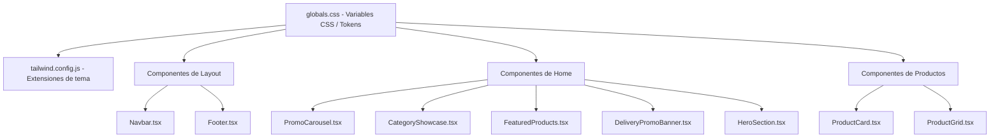

# Documento de Diseño: Rediseño Premium de la Tienda de Skating

## Visión General

Este diseño transforma la identidad visual de la tienda de skating de una estética minimalista con verde lima brillante a una experiencia premium, cálida y sofisticada. La estrategia se basa en modificar las variables CSS centrales en `globals.css` y actualizar los estilos de cada componente visual para adoptar la nueva paleta, manteniendo intacta toda la lógica de negocio y funcionalidad existente.

La inspiración proviene de diseños de restaurantes de lujo: iluminación cálida tipo spotlight, fondos oscuros con profundidad, tonos dorados/amber como acento, y una atmósfera acogedora pero elegante — adaptada al contexto deportivo/skating.

## Arquitectura

La arquitectura existente no cambia. El rediseño es puramente visual y se implementa en tres capas:



**Capa 1 — Tokens de diseño (globals.css):** Redefinir todas las variables CSS (:root y .dark) con la nueva paleta premium. Esta es la base que propaga los cambios a todos los componentes shadcn/ui automáticamente.

**Capa 2 — Estilos utilitarios (globals.css):** Agregar clases utilitarias para efectos premium (glow, vignette, transiciones cálidas).

**Capa 3 — Componentes individuales:** Actualizar clases Tailwind y colores hardcodeados en cada componente para usar la nueva paleta y efectos.

## Componentes e Interfaces

### 1. Sistema de Tokens de Color (globals.css)

**Paleta Premium propuesta para `:root`:**

| Variable | Valor Actual | Valor Nuevo | Propósito |
|---|---|---|---|
| `--primary` | `rgb(16, 244, 0)` (verde lima) | `oklch(0.75 0.15 75)` (~amber/gold #D4A050) | Acento principal dorado |
| `--primary-foreground` | `oklch(0.145 0 0)` (negro) | `oklch(0.15 0 0)` (negro) | Texto sobre primario |
| `--background` | `oklch(0.99 0 0)` (blanco) | `oklch(0.16 0.01 60)` (~#1A1714 marrón muy oscuro) | Fondo principal oscuro |
| `--foreground` | `oklch(0.145 0 0)` (negro) | `oklch(0.93 0 0)` (~#ECE8E1 crema claro) | Texto principal claro |
| `--card` | `oklch(1 0 0)` (blanco) | `oklch(0.22 0.01 60)` (~#2A2520 marrón oscuro) | Fondo de tarjetas |
| `--card-foreground` | `oklch(0.145 0 0)` | `oklch(0.93 0 0)` | Texto en tarjetas |
| `--secondary` | `oklch(0.96 0 0)` | `oklch(0.25 0.01 60)` (~#33302B) | Fondos secundarios |
| `--secondary-foreground` | `oklch(0.205 0 0)` | `oklch(0.85 0 0)` | Texto secundario |
| `--muted` | `oklch(0.96 0 0)` | `oklch(0.25 0.005 60)` | Fondos atenuados |
| `--muted-foreground` | `oklch(0.556 0 0)` | `oklch(0.6 0 0)` | Texto atenuado |
| `--accent` | `oklch(0.96 0 0)` | `oklch(0.28 0.02 70)` | Acento sutil |
| `--accent-foreground` | `oklch(0.205 0 0)` | `oklch(0.93 0 0)` | Texto sobre acento |
| `--border` | `oklch(0.92 0 0)` | `oklch(1 0 0 / 10%)` | Bordes sutiles |
| `--input` | `oklch(0.92 0 0)` | `oklch(1 0 0 / 12%)` | Bordes de inputs |
| `--ring` | `oklch(0.88 0.24 110)` | `oklch(0.75 0.15 75)` | Ring de focus (dorado) |
| `--radius` | `1.5rem` | `1rem` | Bordes redondeados (ligeramente menos redondeados para elegancia) |

**Modo oscuro (.dark):** Se ajustará para ser una variante aún más profunda, con fondos más oscuros y acentos dorados más brillantes.

### 2. Clases Utilitarias Premium (globals.css)

```css
/* Efecto glow cálido para botones y elementos interactivos */
.glow-primary {
  box-shadow: 0 0 20px oklch(0.75 0.15 75 / 0.3);
}

/* Viñeta sutil para secciones hero */
.vignette {
  box-shadow: inset 0 0 150px rgba(0, 0, 0, 0.4);
}

/* Transición premium estándar */
.transition-premium {
  transition: all 0.3s cubic-bezier(0.4, 0, 0.2, 1);
}
```

### 3. Navbar.tsx — Cambios de Estilo

- Fondo: `bg-background/95 backdrop-blur-md` (oscuro con blur)
- Barra superior: `bg-secondary/30` → `bg-secondary/50` con texto `text-muted-foreground`
- Logo circle: `bg-primary` se mantiene (ahora será dorado automáticamente)
- Iconos hover: `hover:text-primary` (ahora dorado)
- Search input: `bg-secondary border-none` → `bg-secondary/50 border border-border`
- Bordes: `border-b` → `border-b border-border` (sutil con opacidad)

### 4. Footer.tsx — Cambios de Estilo

- Fondo: `bg-background` con `border-t border-border`
- Texto: `text-muted-foreground` (se hereda automáticamente)
- Iconos sociales hover: `hover:text-primary` (dorado)

### 5. PromoCarousel.tsx — Cambios de Estilo

- Botón CTA: Reemplazar `bg-[#D7F000]` → `bg-primary text-primary-foreground`
- Shadow del CTA: `shadow-[0_0_20px_rgba(215,240,0,0.3)]` → clase `glow-primary`
- Controles hover: `hover:bg-[#D7F000]` → `hover:bg-primary`
- Indicador activo: `bg-[#D7F000]` → `bg-primary`
- Gradientes de overlay: Mantener pero intensificar ligeramente para mejor contraste

### 6. ProductCard.tsx — Cambios de Estilo

- Card: `bg-card` (ahora oscuro), agregar `border border-border`
- Fondo de imagen: `bg-[#F8F9FA]` → `bg-secondary`
- Hover shadow: `hover:shadow-xl` → `hover:shadow-[0_8px_30px_rgba(212,160,80,0.15)]`
- Precio: Agregar `text-primary` al precio actual
- Botón favorito: `bg-white/60` → `bg-card/60`, estados coherentes con paleta

### 7. CategoryShowcase.tsx — Cambios de Estilo

- Círculos: `bg-secondary` (ahora oscuro), agregar `border border-border`
- Hover: `group-hover:bg-primary` (ahora dorado)
- Texto: `text-muted-foreground` → se hereda automáticamente
- Encabezado: Texto claro automático por `foreground`

### 8. FeaturedProducts.tsx — Cambios de Estilo

- Badge countdown: `bg-[#D7F000] text-black` → `bg-primary text-primary-foreground`
- Encabezados y texto: Se heredan automáticamente de las variables

### 9. DeliveryPromoBanner.tsx — Cambios de Estilo

- Fondo: `backgroundColor: bgColor` → usar `bg-card` como fallback con borde
- Badge: `bg-white border border-emerald-100` → `bg-primary/10 border border-primary/30 text-primary`
- Texto: `text-[#1A1A1A]` → `text-foreground`
- Formas abstractas: Actualizar colores `#D4A574` → usar tonos de la paleta primary

### 10. HeroSection.tsx — Cambios de Estilo

- Fondo: `bg-muted` → gradiente oscuro con efecto spotlight cálido
- Botón primario: `Button` hereda automáticamente el dorado
- Botón secundario: `bg-background/80 backdrop-blur-sm` con borde
- Agregar clase `vignette` al contenedor

## Modelos de Datos

No se requieren cambios en modelos de datos. El rediseño es puramente visual y no afecta la estructura de datos, APIs, ni lógica de negocio. Los únicos "datos" que cambian son los tokens de diseño (variables CSS) definidos en `globals.css`.


## Propiedades de Correctitud

*Una propiedad es una característica o comportamiento que debe mantenerse verdadero en todas las ejecuciones válidas de un sistema — esencialmente, una declaración formal sobre lo que el sistema debe hacer. Las propiedades sirven como puente entre especificaciones legibles por humanos y garantías de correctitud verificables por máquina.*

### Propiedad 1: La tarjeta es más clara que el fondo

*Para cualquier* configuración válida de la paleta premium, el valor de luminosidad (lightness en oklch) de `--card` debe ser estrictamente mayor que el de `--background`, garantizando profundidad visual entre capas.

**Valida: Requisito 1.3**

### Propiedad 2: Ratio de contraste accesible

*Para cualquier* par de variables CSS de texto/fondo (foreground/background, card-foreground/card, primary-foreground/primary, secondary-foreground/secondary, muted-foreground/muted, accent-foreground/accent), el ratio de contraste calculado debe ser mayor o igual a 4.5:1 según las directrices WCAG AA.

**Valida: Requisito 1.6**

### Propiedad 3: Completitud de variables CSS

*Para cualquier* tema definido (`:root` y `.dark`), todas las variables CSS requeridas (primary, primary-foreground, background, foreground, card, card-foreground, secondary, secondary-foreground, muted, muted-foreground, accent, accent-foreground, destructive, destructive-foreground, border, input, ring, radius, chart-1 a chart-5, sidebar-background, sidebar-foreground, sidebar-primary, sidebar-primary-foreground, sidebar-accent, sidebar-accent-foreground, sidebar-border, sidebar-ring) deben estar presentes y definidas.

**Valida: Requisitos 1.4, 1.5**

### Propiedad 4: Jerarquía tipográfica

*Para cualquier* conjunto de encabezados renderizados (h1, h2, h3) y texto de cuerpo, el tamaño de fuente computado debe mantener el orden h1 ≥ h2 ≥ h3 > cuerpo, preservando la jerarquía visual.

**Valida: Requisito 2.3**

### Propiedad 5: Ausencia de colores legacy hardcodeados

*Para cualquier* archivo de componente en `src/components/skating-store/`, el código fuente no debe contener referencias directas a los colores legacy `#D7F000`, `#10F400`, `#E9F7E8`, ni `#F8F9FA`, debiendo usar variables CSS o clases Tailwind en su lugar.

**Valida: Requisitos 5.2, 5.3, 8.1, 11.1, 11.3**

## Manejo de Errores

El rediseño es puramente visual y no introduce nuevos flujos de error. Los escenarios a considerar son:

1. **Fallback de variables CSS:** Si una variable CSS no se define correctamente, los componentes shadcn/ui pueden mostrar colores inesperados. Mitigación: la Propiedad 3 verifica completitud de variables.

2. **Contraste insuficiente:** Si los colores elegidos no cumplen WCAG AA, el texto puede ser ilegible. Mitigación: la Propiedad 2 verifica ratios de contraste.

3. **Colores hardcodeados residuales:** Si algún componente mantiene colores legacy, habrá inconsistencia visual. Mitigación: la Propiedad 5 detecta colores legacy.

4. **Compatibilidad con contenido dinámico:** Los banners y promos usan colores desde la base de datos (bgColor). El fallback debe usar variables CSS de la nueva paleta en lugar de colores hardcodeados.

## Estrategia de Testing

### Tests Unitarios

- Verificar que `globals.css` contiene todas las variables CSS requeridas para `:root` y `.dark`
- Verificar que las clases utilitarias premium (`glow-primary`, `vignette`, `transition-premium`) están definidas
- Verificar que las animaciones existentes (`infinite-scroll`, `accordion-down`, `accordion-up`) se mantienen
- Verificar que la fuente Archivo Black se aplica a encabezados en la capa base

### Tests de Propiedades (Property-Based Testing)

Biblioteca recomendada: **fast-check** (TypeScript/JavaScript)

Configuración: Mínimo 100 iteraciones por test de propiedad.

Cada test debe estar anotado con un comentario referenciando la propiedad del diseño:

- **Feature: store-premium-redesign, Property 1: La tarjeta es más clara que el fondo** — Generar pares aleatorios de valores oklch para card y background, verificar que card.lightness > background.lightness
- **Feature: store-premium-redesign, Property 2: Ratio de contraste accesible** — Para cada par fg/bg de la paleta, calcular el ratio de contraste y verificar >= 4.5
- **Feature: store-premium-redesign, Property 3: Completitud de variables CSS** — Parsear el CSS y verificar que todas las variables requeridas están presentes
- **Feature: store-premium-redesign, Property 4: Jerarquía tipográfica** — Generar conjuntos aleatorios de tamaños de fuente para h1/h2/h3/body y verificar el orden
- **Feature: store-premium-redesign, Property 5: Ausencia de colores legacy** — Escanear todos los archivos de componentes y verificar ausencia de colores hardcodeados legacy

### Tests de Integración Visual

- Verificar que cada componente renderiza correctamente con la nueva paleta (snapshot tests opcionales)
- Verificar que la funcionalidad existente (navegación, carrito, búsqueda, favoritos) no se ve afectada por los cambios de estilo
