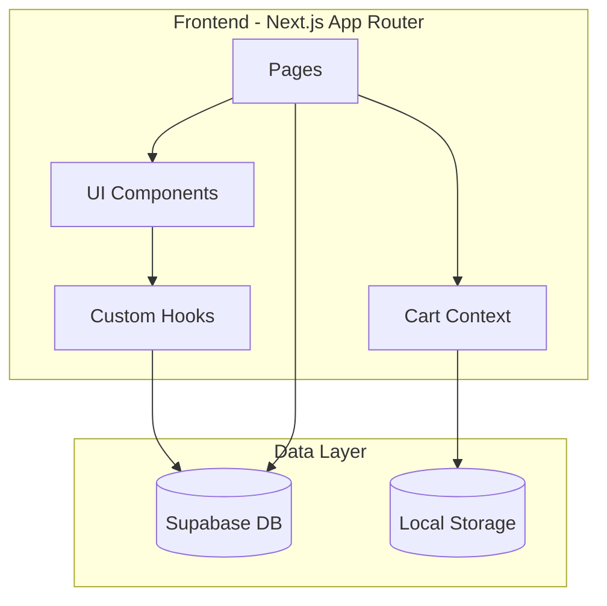

# Design Document: Skating Ecommerce UI

## Overview

Este documento describe el diseño técnico para un ecommerce web de productos de patinaje. El sistema está construido con Next.js 14 (App Router), Tailwind CSS, shadcn/ui para componentes, y Supabase como backend. El diseño se enfoca en una experiencia de usuario fluida para escritorio con un carrito de compras funcional y persistencia de datos.

## Architecture

### High-Level Architecture



### Application Structure

```
src/
├── app/
│   └── skating-store/
│       ├── page.tsx                 # Home page
│       ├── layout.tsx               # Store layout with Navbar/Footer
│       ├── catalogo/
│       │   └── page.tsx             # Product catalog
│       ├── producto/
│       │   └── [id]/
│       │       └── page.tsx         # Individual product
│       ├── carrito/
│       │   └── page.tsx             # Shopping cart
│       ├── checkout/
│       │   └── page.tsx             # Checkout process
│       ├── sobre-nosotros/
│       │   └── page.tsx             # About us
│       └── contacto/
│           └── page.tsx             # Contact
├── components/
│   └── skating-store/
│       ├── layout/
│       │   ├── Navbar.tsx
│       │   ├── Footer.tsx
│       │   └── CartIcon.tsx
│       ├── products/
│       │   ├── ProductCard.tsx
│       │   ├── ProductGrid.tsx
│       │   ├── ProductGallery.tsx
│       │   └── CategoryFilter.tsx
│       ├── cart/
│       │   ├── CartItem.tsx
│       │   ├── CartSummary.tsx
│       │   └── CartDrawer.tsx
│       ├── checkout/
│       │   ├── CheckoutForm.tsx
│       │   ├── OrderSummary.tsx
│       │   └── ShippingForm.tsx
│       └── home/
│           ├── HeroSection.tsx
│           ├── FeaturedProducts.tsx
│           └── CategoryShowcase.tsx
├── contexts/
│   └── SkatingCartContext.tsx
├── hooks/
│   └── skating-store/
│       ├── useProducts.ts
│       ├── useCart.ts
│       └── useOrders.ts
├── types/
│   └── skating-store.ts
└── lib/
    └── skating-store/
        └── supabase-queries.ts
```

## Components and Interfaces

### Core Types

```typescript
// types/skating-store.ts

export type ProductCategory = 
  | 'patines-completos'
  | 'ruedas'
  | 'bases-frames'
  | 'botas'
  | 'protecciones'
  | 'accesorios';

export interface Product {
  id: string;
  name: string;
  description: string;
  price: number;
  category: ProductCategory;
  images: string[];
  stock: number;
  featured: boolean;
  created_at: string;
  updated_at: string;
}

export interface CartItem {
  product: Product;
  quantity: number;
}

export interface ShippingInfo {
  fullName: string;
  address: string;
  city: string;
  postalCode: string;
  phone: string;
}

export interface Order {
  id: string;
  items: CartItem[];
  shipping: ShippingInfo;
  total: number;
  status: 'pending' | 'confirmed' | 'shipped' | 'delivered';
  created_at: string;
}

export interface ContactMessage {
  id: string;
  name: string;
  email: string;
  message: string;
  created_at: string;
}
```

### Component Interfaces

```typescript
// ProductCard Props
interface ProductCardProps {
  product: Product;
  onAddToCart?: (product: Product) => void;
}

// ProductGallery Props
interface ProductGalleryProps {
  images: string[];
  productName: string;
}

// CategoryFilter Props
interface CategoryFilterProps {
  categories: ProductCategory[];
  selectedCategory: ProductCategory | null;
  onCategoryChange: (category: ProductCategory | null) => void;
}

// CartContext Interface
interface CartContextType {
  items: CartItem[];
  addItem: (product: Product, quantity: number) => void;
  removeItem: (productId: string) => void;
  updateQuantity: (productId: string, quantity: number) => void;
  clearCart: () => void;
  total: number;
  itemCount: number;
}

// CheckoutForm Props
interface CheckoutFormProps {
  onSubmit: (shipping: ShippingInfo) => Promise<void>;
  isLoading: boolean;
}
```

### Key Components

#### Navbar Component
- Fixed position at top
- Logo on left side
- Navigation links: Home, Catálogo, Sobre Nosotros, Contacto
- Cart icon with item count badge on right
- Uses shadcn/ui NavigationMenu

#### ProductCard Component
- Displays product image with hover effect
- Product name and price
- Quick "Add to Cart" button on hover
- Click navigates to product detail page
- Uses shadcn/ui Card component

#### ProductGallery Component
- Main image display area
- Thumbnail navigation below
- Click thumbnail to change main image
- Smooth transition animations

#### CartDrawer Component
- Slide-in drawer from right side
- Lists all cart items with quantities
- Update quantity controls
- Remove item button
- Total calculation
- "Proceed to Checkout" button
- Uses shadcn/ui Sheet component

#### CategoryFilter Component
- Horizontal filter bar
- Category buttons/pills
- "All" option to clear filter
- Active state styling
- Uses shadcn/ui ToggleGroup

## Data Models

### Supabase Schema

```sql
-- Products table
CREATE TABLE skating_products (
  id UUID PRIMARY KEY DEFAULT gen_random_uuid(),
  name VARCHAR(255) NOT NULL,
  description TEXT,
  price DECIMAL(10,2) NOT NULL,
  category VARCHAR(50) NOT NULL,
  images TEXT[] DEFAULT '{}',
  stock INTEGER DEFAULT 0,
  featured BOOLEAN DEFAULT false,
  created_at TIMESTAMP WITH TIME ZONE DEFAULT NOW(),
  updated_at TIMESTAMP WITH TIME ZONE DEFAULT NOW()
);

-- Orders table
CREATE TABLE skating_orders (
  id UUID PRIMARY KEY DEFAULT gen_random_uuid(),
  customer_name VARCHAR(255) NOT NULL,
  customer_address TEXT NOT NULL,
  customer_city VARCHAR(100) NOT NULL,
  customer_postal_code VARCHAR(20) NOT NULL,
  customer_phone VARCHAR(50) NOT NULL,
  items JSONB NOT NULL,
  total DECIMAL(10,2) NOT NULL,
  status VARCHAR(20) DEFAULT 'pending',
  created_at TIMESTAMP WITH TIME ZONE DEFAULT NOW()
);

-- Contact messages table
CREATE TABLE skating_contact_messages (
  id UUID PRIMARY KEY DEFAULT gen_random_uuid(),
  name VARCHAR(255) NOT NULL,
  email VARCHAR(255) NOT NULL,
  message TEXT NOT NULL,
  created_at TIMESTAMP WITH TIME ZONE DEFAULT NOW()
);

-- Row Level Security
ALTER TABLE skating_products ENABLE ROW LEVEL SECURITY;
ALTER TABLE skating_orders ENABLE ROW LEVEL SECURITY;
ALTER TABLE skating_contact_messages ENABLE ROW LEVEL SECURITY;

-- Public read access for products
CREATE POLICY "Products are viewable by everyone" 
  ON skating_products FOR SELECT 
  USING (true);

-- Public insert for orders
CREATE POLICY "Anyone can create orders" 
  ON skating_orders FOR INSERT 
  WITH CHECK (true);

-- Public insert for contact messages
CREATE POLICY "Anyone can send contact messages" 
  ON skating_contact_messages FOR INSERT 
  WITH CHECK (true);
```

### Cart State Structure (Local Storage)

```typescript
interface CartState {
  items: Array<{
    productId: string;
    quantity: number;
  }>;
  lastUpdated: string;
}
```


## Correctness Properties

*A property is a characteristic or behavior that should hold true across all valid executions of a system—essentially, a formal statement about what the system should do. Properties serve as the bridge between human-readable specifications and machine-verifiable correctness guarantees.*

### Property 1: Cart Icon Count Accuracy

*For any* cart state with N items, the cart icon in the Navbar SHALL display the number N, where N is the sum of quantities of all cart items.

**Validates: Requirements 1.5, 5.2**

### Property 2: Featured Products Display

*For any* set of products in the database, the home page SHALL display exactly those products where `featured = true`.

**Validates: Requirements 2.3**

### Property 3: Category Filter Correctness

*For any* selected category filter, all products displayed in the catalog SHALL have a `category` field matching the selected filter. When no filter is selected, all products SHALL be displayed.

**Validates: Requirements 3.3**

### Property 4: Product Catalog Completeness

*For any* set of products in the database, the catalog page (with no filter) SHALL display all products from the database.

**Validates: Requirements 3.1**

### Property 5: Product Card Navigation

*For any* product card clicked in the catalog, the navigation SHALL route to `/skating-store/producto/{product.id}` where `product.id` matches the clicked product's ID.

**Validates: Requirements 3.4**

### Property 6: Gallery Image Navigation

*For any* product with multiple images, clicking a thumbnail in the Product_Gallery SHALL update the main image display to show the corresponding image.

**Validates: Requirements 4.2, 10.3**

### Property 7: Product Information Display

*For any* product, the Product_Card and product detail page SHALL display the product's name, price, and (on detail page) description exactly as stored in the database.

**Validates: Requirements 4.3, 10.1**

### Property 8: Add to Cart Functionality

*For any* product and quantity Q, clicking "Agregar al carrito" SHALL result in the cart containing that product with quantity increased by Q. If the product already exists in cart, the quantity SHALL be the sum of existing quantity plus Q.

**Validates: Requirements 4.5**

### Property 9: Cart Item Information Display

*For any* cart item, the Shopping_Cart SHALL display: product image, product name, quantity, unit price (product.price), and subtotal (quantity × price).

**Validates: Requirements 5.2**

### Property 10: Cart Total Calculation

*For any* cart state, the displayed total SHALL equal the sum of all item subtotals, where each subtotal = item.quantity × item.product.price.

**Validates: Requirements 5.3, 5.5**

### Property 11: Cart Item Removal

*For any* cart item removed, the cart SHALL no longer contain that item, and the total SHALL be recalculated excluding the removed item's subtotal.

**Validates: Requirements 5.4**

### Property 12: Cart Persistence Round-Trip

*For any* cart state, saving to localStorage and then loading from localStorage SHALL produce an equivalent cart state with the same items and quantities.

**Validates: Requirements 5.6**

### Property 13: Checkout Form Validation

*For any* checkout form submission with one or more empty required fields (fullName, address, city, postalCode, phone), the form SHALL not submit and SHALL display validation errors for each empty field.

**Validates: Requirements 6.4**

### Property 14: Order Creation on Checkout

*For any* successful checkout with valid shipping information and non-empty cart, an Order record SHALL be created in Supabase with: matching items, correct total, customer information, and status 'pending'.

**Validates: Requirements 6.6, 9.5**

### Property 15: Cart Clear After Checkout

*For any* successful checkout, the Shopping_Cart SHALL be empty (zero items) after the order is created.

**Validates: Requirements 6.7**

### Property 16: Contact Form Submission

*For any* valid contact form submission (non-empty name, valid email, non-empty message), a ContactMessage record SHALL be created in Supabase with matching field values.

**Validates: Requirements 8.2**

## Error Handling

### Client-Side Errors

| Error Type | Handling Strategy |
|------------|-------------------|
| Form validation errors | Display inline error messages below each invalid field using shadcn/ui Form components |
| Network errors (fetch products) | Display error toast and retry button, show cached data if available |
| Add to cart with zero stock | Disable add button, show "Out of Stock" message |
| Invalid product ID in URL | Redirect to catalog with "Product not found" toast |
| LocalStorage unavailable | Fall back to in-memory cart state with warning |

### Server-Side Errors

| Error Type | Handling Strategy |
|------------|-------------------|
| Supabase connection failure | Return 503 with retry-after header, display user-friendly error |
| Order creation failure | Return 500, do not clear cart, display error with retry option |
| Contact form submission failure | Return 500, preserve form data, display error message |
| Invalid request data | Return 400 with validation error details |

### Error Display Components

```typescript
// Error boundary for product pages
interface ProductErrorBoundaryProps {
  fallback: React.ReactNode;
  children: React.ReactNode;
}

// Toast notifications for transient errors
type ToastType = 'success' | 'error' | 'warning' | 'info';

interface ToastConfig {
  type: ToastType;
  title: string;
  description?: string;
  duration?: number;
}
```

## Testing Strategy

### Dual Testing Approach

This project uses both unit tests and property-based tests for comprehensive coverage:

- **Unit tests**: Verify specific examples, edge cases, and error conditions
- **Property tests**: Verify universal properties across all valid inputs

### Testing Framework

- **Unit Testing**: Jest + React Testing Library
- **Property-Based Testing**: fast-check
- **E2E Testing**: Playwright (optional, for critical flows)

### Property-Based Test Configuration

Each property test MUST:
- Run minimum 100 iterations
- Reference the design document property number
- Use tag format: **Feature: skating-ecommerce-ui, Property {number}: {property_text}**

### Test Categories

#### Unit Tests

1. **Component Rendering Tests**
   - Navbar renders with all navigation links
   - Footer renders with social media icons
   - ProductCard renders with product data
   - ProductGallery renders with images
   - CartDrawer renders cart items

2. **Edge Case Tests**
   - Empty cart state
   - Single item in cart
   - Product with single image (no gallery navigation)
   - Form submission with all fields empty
   - Invalid email format in contact form

3. **Integration Tests**
   - Add product to cart flow
   - Complete checkout flow
   - Contact form submission flow

#### Property-Based Tests

Each correctness property (1-16) SHALL have a corresponding property-based test:

```typescript
// Example: Property 10 - Cart Total Calculation
// Feature: skating-ecommerce-ui, Property 10: Cart total equals sum of subtotals
test.prop([fc.array(cartItemArbitrary, { minLength: 0, maxLength: 20 })])(
  'cart total equals sum of all item subtotals',
  (items) => {
    const expectedTotal = items.reduce(
      (sum, item) => sum + item.quantity * item.product.price,
      0
    );
    const cart = createCart(items);
    expect(cart.total).toBeCloseTo(expectedTotal, 2);
  }
);
```

### Test Data Generators (Arbitraries)

```typescript
// Product arbitrary
const productArbitrary = fc.record({
  id: fc.uuid(),
  name: fc.string({ minLength: 1, maxLength: 100 }),
  description: fc.string({ maxLength: 500 }),
  price: fc.float({ min: 0.01, max: 10000, noNaN: true }),
  category: fc.constantFrom(
    'patines-completos', 'ruedas', 'bases-frames', 
    'botas', 'protecciones', 'accesorios'
  ),
  images: fc.array(fc.webUrl(), { minLength: 1, maxLength: 5 }),
  stock: fc.integer({ min: 0, max: 1000 }),
  featured: fc.boolean(),
});

// CartItem arbitrary
const cartItemArbitrary = fc.record({
  product: productArbitrary,
  quantity: fc.integer({ min: 1, max: 99 }),
});

// ShippingInfo arbitrary
const shippingInfoArbitrary = fc.record({
  fullName: fc.string({ minLength: 1, maxLength: 100 }),
  address: fc.string({ minLength: 1, maxLength: 200 }),
  city: fc.string({ minLength: 1, maxLength: 100 }),
  postalCode: fc.stringMatching(/^\d{5}$/),
  phone: fc.stringMatching(/^\+?\d{9,15}$/),
});
```

### Coverage Requirements

- Unit test coverage: minimum 80% for components
- Property tests: all 16 correctness properties covered
- Critical paths (checkout, cart operations) must have integration tests
